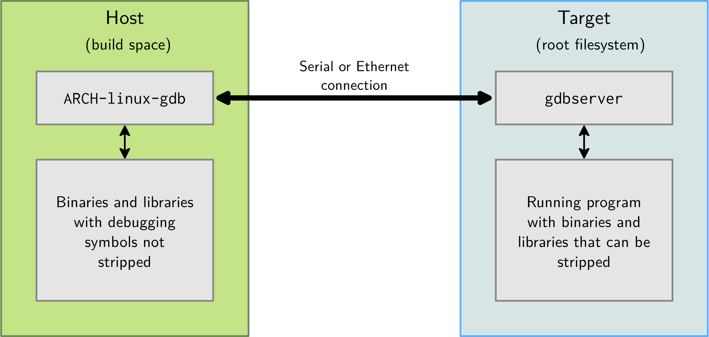
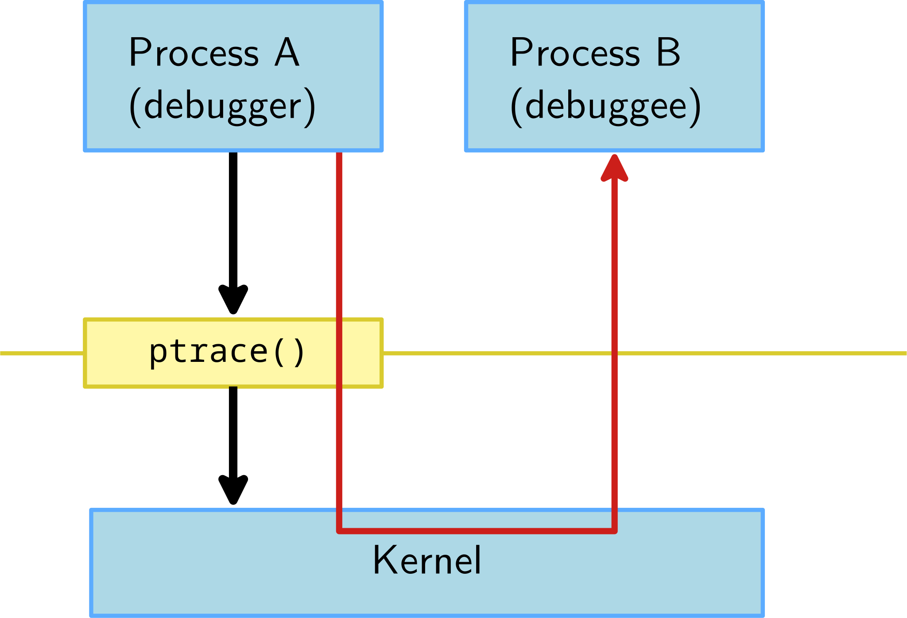

GDB使用
===========================================================

.. note:: “Everyone knows that debugging is twice as hard as writing a program in the first place.
    So if you’re as clever as you can be when you write it, how will you ever debug it?”
    – Brian Kernighan

GDB，全称GNU-Progject Debugger，可用于大多数嵌入式架构，支持市面上常见的语言，提供CLI交互，在大多数图形IDE中集成。

GDB常用于：

* 控制运行中程序的执行流，设置断点、修改内部变量
* 查看程序崩溃时做了什么，验尸（post mortem analysis）

利于调试的最佳编码实践：

.. _-fanalyzer: https://gcc.gnu.org/onlinedocs/gcc-11.1.0/gcc/Static-Analyzer-Options.html
.. _dedicated tools: https://clang-analyzer.llvm.org/command-line.html

* 代码简洁，易于实现、理解、调试
* 积极利用警告flag让编译器辅助检测错误，推荐-Werror、-Wall、-Wextra
* 积极利用编译器的静态分析功能，GCC是 `-fanalyzer`_ 标志，LLVM提供了 `dedicated tools`_ 工具

参考链接：

* `GNU GDB项目 <https://www.gnu.org/software/gdb/>`_
* `Gdb WIKI <https://en.wikipedia.org/wiki/Gdb>`_
* LLVM项目的 `lldb <https://lldb.llvm.org/>`_

GDB速通
-----------------------------------------------------------

主要用于调试进程，使用gdb启动该程序：

::

    $ gdb <program>

GDB亦可使用程序PID附着其上：

::

    $ gdb -p <pid>

使用 GDB 启动程序，需要执行run：

::

    $  (gdb) run

一些有用的GDB命令：

* break foobar (b) 在函数 foobar 的入口设置断点
* break foobar.c:42 在 foobar.c 的42行设置断点
* print var, print $reg, print task->files[0].fd(p) 打印变量var,寄存器$reg或复杂引用
* print\x ... 打印以16进制方式
* info registers 显示寄存器
* continue (c) 断点后继续执行
* next (n) 单行调试，单步执行函数调用
* step (s) 单行调试，进入子函数
* stepi (si) 单指令调试
* finish 执行完函数直至返回
* backtrace (bt) 打印栈

GDB高级命令
-----------------------------------------------------------

* info threads (i threads)
    * 显示可用线程的列表
* info breakpoints (i b)
    * 显示断点/观察点的列表
* delete <n> (d <n>)
    * 删除断点<n>
* thread <n> (t <n>)
    * 选择线程数字<n>
* frame <n> (f <n>)
    * 从backtrace中选择一个指定frame，该数字是在每行开头使用backtrace时显示的数字
* watch <variable> or watch \*<address>
    * 在指定变量或指定地址上添加观察点
* print variable = value (p variable = value)
    * 使用新值修改指定变量的内容
* break if condition == value
    * 仅当指定条件为true时跳出
* watch if condition == value
    * 仅当指定条件为true时触发观察点
* x/<n><u> <address>
    * 显示所提供地址的内存。n is the amount of memory to display, u is the type of data to be displayed (b/h/w/g). Instructions can be displayed using the i type.
* list <expr>
    * 显示当前程序计数器位置关联的源代码。
* disassemble <location,start_offset,end_offset> (disas)
    * 显示当前执行的汇编代码。
* p $newvar = value
    * 声明一个新的gdb变量，可在本地使用或在命令序列中使用。
* p function(arguments)
    * 使用GDB执行一个函数。注意: 执行函数时小心带来的任何副作用。
* define <command_name>
    * 定义一个新的命令序列。GDB将提示输入命令序列。

GDB远程调试
-----------------------------------------------------------

在非嵌入式环境中，经常使用gdb或它的其他前端进行调试。gdb可通过调试符号直接访问二进制和库。但在嵌入式上下文中，目标平台环境通常受限，无法允许使用gdb直接调试（x86上2.4MB体积）。

所以远程调试更优先，ARCH-linux-gdb 用在开发环境上，提供它的所有功能。而gdbserver工作在目标系统上（arm上400KB）

其拓扑图： 

.. image:: ../res/gdb远程调试拓扑图.svg

其框图：

远程调试的手法：

* 目标平台，通过gdbserver运行程序，程序执行不会立即开始。

    ::

        gdbserver localhost:<port> <executable> <args>
        gdbserver /dev/ttyS0 <executable> <args>

* 或者，附着gdbserver到正在运行的程序上

    ::

        gdbserver --attach localhost:<port> <pid>

* 然后，在主机上，启动 `ARCH-linux-gdb <executable>`，并使用以下gdb命令：

    * 告诉gdb共享库在哪

    ::

        gdb> set sysroot <library-path> (不带lib/的构建空间的典型路径)

    * 连接目标平台

    ::

        gdb> target remote <ip-addr>:<port> (networking)
        gdb> target remote /dev/ttyUSB0 (serial link)

从OS层面看调试器是如何工作的
-----------------------------------------------------------

应用与内核交互示意图

.. image:: ../res/应用与内核交互示意图.svg

一般进程不直接访问硬件资源，内核隔离了硬件、进程和其他进程，进程通过syscall向内核请求服务的方式使用，一般这些syscall被C库所包装。

debugger和debuggee的关系示意图：

debugger和debuggee是不同的进程，彼此间是无法访问内存和控制执行流的，所以debugger使用ptrace()系统调用来控制一个进程的执行并读/写它的数据。

ptrace系统调用介绍

* 其允许进程跟踪其他进程，可以访问被跟踪者的内存和寄存器内容
* 跟踪者可观察和控制被跟踪进程的执行状态
* 通过使用ptrace()系统调用附着到被跟踪进程上，参见（man 2 ptrace）
* 可使用ptrace()直接执行，但通过不止使用，而是通过其他工具（gdb）
* 被GDB、strace和所有的调试工具使用

其函数：

::

    Long ptrace(enum __ptrace_request_ request, pid_t pid, void *addr, void *data);

GDB实战
-----------------------------------------------------------

编译：

::

    gcc [flags] <source files> -o <output file>
    # 如
    gcc -Wall -Werror -ansi -pedantic-errors prog1.c -o prog1.x

添加 -g 来启用调试支持：

::

    gcc [other flags] -g <source files> -o <output file>
    # 如
    gcc -Wall -Werror -ansi -pedantic-errors -g prog1.c -o prog1.x

启动 gdb:

::

    gdb prog1.x
    # 或
    (gdb) file prog1.x

    (gdb) run

参考资料
-----------------------------------------------------------

GDB之歌，很有意思

::

    Let's start at the very beginning, a very good place to start,

    When you're learning to sing, its Do, Re, Mi;
    When you're learning to code, its G, D, B.

    (background) G, D, B.

    The first three letters just happen to be, G, D, B.

    (background) G, D, B.

    (Chorus)

    G!,
    GNU!, it's Stallman's hope,
    D,
    debug that rotten code,
    B,
    a break I set myself.
    Run,
    a far, far way to go.
    Print,
    to see what you have done,
    Set,
    a patch that follows print.
    Quit,
    and recompile your code - - -
    That will bring it back to G,
                                  D,
                                     B,
                                        <link>
    (Resume from the Chorus)

.. _GDB之歌: https://www.gnu.org/music/gdb-song.html

1. `GDB之歌`_