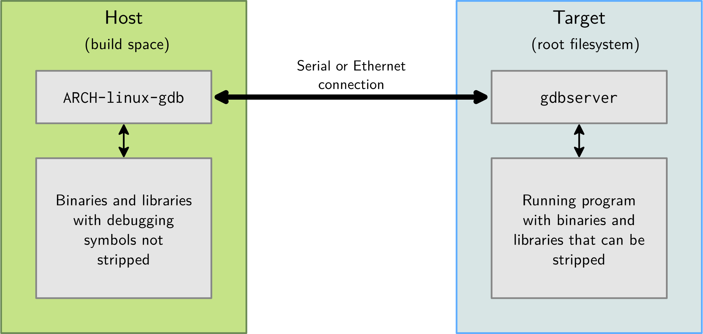
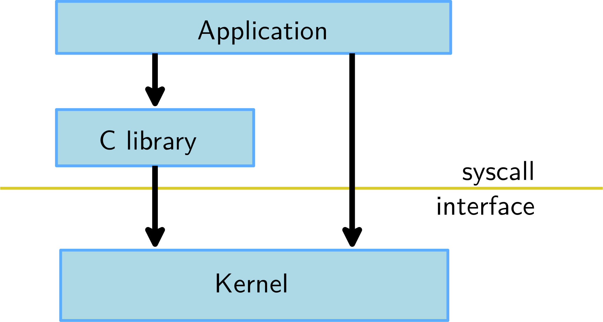
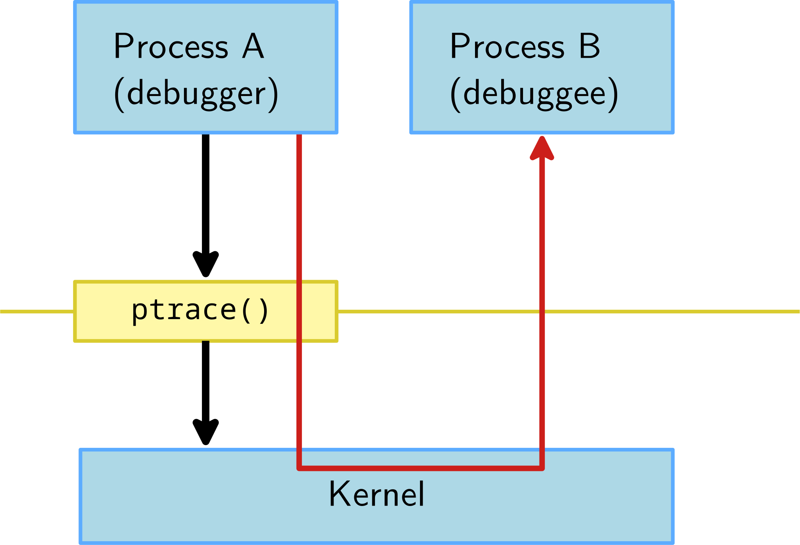

GDB调试器教程2——debuginfo
===========================================================
 
在本系列的第一篇文章“调试器入门”中，我介绍了 GNU 调试器 （GDB），
并向您介绍了其常见的启动选项和过程。正如我在第 1 部分中承诺的那样，
本文将介绍用于描述已编译代码的调试信息。

什么是调试信息？
-----------------------------------------------------------

简单地说，调试信息（简称debuginfo）由编译器和其他工具输出，以告知其他
开发工具有关编译代码的信息。Debuginfo 传达有关程序或库的重要信息，包括
将可执行代码映射回原始源代码的行表;文件名和包含的文件;程序中函数、变量和
类型的描述;以及更多。

所有这些信息都被其他工具（包括 GDB）使用，让用户可以逐行单步执行程序的源
代码、检查变量和堆栈回溯，以及执行其他基本的开发和调试任务。

DWARF 是当今大多数操作系统（包括 GNU Linux、BSD 和其他 Unix 衍生产品）
上使用的 debuginfo 标准。它与语言和架构无关。相同的 debuginfo 格式适用
于任何体系结构（包括 x86_64、PowerPC 或 RISC）或任何语言（包括 C 和 C++、
Ada、D 或 Rust）。

编译器和其他工具输出的调试信息条目 （DIE） 提供编译源代码的低级描述。每个 
DIE 都由一个识别标签和各种属性组成，这些属性传递有关所代表实体的重要信息。
各种源语言概念（如函数）可以由几个 DIE 描述，这些 DIE 基本上按层次结构顺序
排列，子 DIE 细化了其父 DIE 的描述。

阅读 debuginfo：一个简单的用例
-----------------------------------------------------------

为了说明一个（非常）简单的案例，请考虑以下 C 语言中的“Hello， World！”示例：

::

    1 #include <stdio.h>
    2
    3 int
    4 main (void)
    5 {
    6   int counter;
    7
    8   for (counter = 0; counter < 10; ++counter)
    9     printf ("Hello, World (%d)!\n", counter);
    10
    11   return 0;
    12 }

如果将其保存到使用调试信息命名和编译的文件中（请参阅本系列第一篇文章中关于编译器
标志的讨论），则描述此程序的输出可能类似于此处的伪 DIE：hello.c

::

    DW_TAG_compile_unit
        DW_AT_producer: “gcc -g”
        DW_AT_language: “C”
        DW_AT_name: “hello.c”
        DW_AT_comp_dir: “/home/keiths”
        DW_TAG_base_type
            DW_AT_name: “int”
        DW_TAG_subprogram
            DW_AT_name: “main”
            DW_AT_decl_file: 1
            DW_AT_decl_line: 4
            DW_AT_type: link to DIE describing “int”
            DW_TAG_variable
                DW_AT_name: “counter”
                DW_AT_decl_file: 1
                DW_AT_decl_line: 6
                DW_AT_type: link to DIE describing “int”
            much more

生成的调试信息描述了一个名称为 的编译单元，其中包含一个名为 的函数，该函数在 的
第 4 行中定义。此函数包含一个名为的变量，该变量在第 6 行定义，依此类推。当然，
真正的 DWARF 输出将包含更多信息，例如这些实体在内存中的位置，但这个简单示例演示了 
DWARF DIE 的层次结构。hello.cmainhello.ccounter

debuginfo存储在哪里，如何获取它？
-----------------------------------------------------------

调试信息存储在多个位置，包括本地和远程文件系统。根据您要调试的内容，GDB 和其他工具
会在以下位置搜索所需的调试信息。

1. 程序的 ELF 部分
对于您自己编写的程序，例如我的“Hello， World！”示例，调试信息存储在 ELF 文件本身中。当文件加载到使用 debuginfo 的工具中时，这些工具将根据需要读取与调试信息（、、等）相关的各种 ELF 部分。.debug_abbrev.debug_aranges.debug_info

2. 按名称分隔调试目录
对于由 Red Hat 等供应商分发的程序和库，所有调试信息都会从程序和库中剥离并保存到单独的包中。例如，程序在包中，其调试信息在包中。cpcoreutilscoreutils-debuginfo

若要为任何发行版提供的包（如 ）安装 debuginfo，请使用 。这也将下载包含该包源代码的关联包。coreutilsdnf debuginfo-install coreutilsdebugsrc

这些单独的 debuginfo 包安装在 下，这是一个保存发行版范围的 debuginfo 的特殊目录。GDB 等工具知道在搜索任何缺少的调试信息时要查找此目录。/usr/lib/debug

3. 按构建 ID 分隔调试目录
构建 ID 是目标文件中的 ELF 注释段。生成 ID 本质上是一个哈希值，用于唯一标识程序或库的任何给定版本。工具将查找此特殊注释段以查找生成 ID，并使用它来查找生成 ID 调试目录中的 debuginfo。（在本文的后面部分，你将学习如何查询对象文件的内部版本 ID。/usr/lib/debug/.build-id

4. 按构建 ID 的 debuginfod 服务器
许多工具（包括 GDB）都支持使用 debuginfod 服务器，该服务器允许用户按需从集中式服务器下载调试信息。debuginfod 下载的任何 debuginfo 都将存储在用户主目录 .$HOME/.cache/debuginfod_client

使用 debuginfod
-----------------------------------------------------------

若要使用 debuginfod，请将环境变量设置为指向要检查 debuginfo 的任何服务器。由 elfutils 项目维护的上游联合服务器可用于自动访问任何维护发行版的调试信息：DEBUGINFOD_URLS

$ export DEBUGINFOD_URLS="https://debuginfod.elfutils.org/ $DEBUGINFOD_URLS"
GDB 12 还包含用于控制 debuginfod 客户端库的新命令（每个命令还具有相应的 show 等效项）：

set debuginfod enabled on/off/ask：启用或禁用 GDB 的 debuginfod 支持。如果设置为（debuginfod 支持可用时的默认值），GDB 将要求用户确认使用 debuginfod 下载当前会话缺少的调试信息。要永久启用此功能，请添加到启动脚本中。（有关启动脚本的详细信息，请参阅本系列的上一篇文章。askset debuginfod enabled on.gdbinit
set debuginfod urls LIST：允许您提供以空格分隔的 URL 列表，从中查询 debuginfo。如果在 GDB 中启用了 debuginfod 支持，则默认为环境变量。DEBUGINFOD_URLS
set debuginfod verbose on/off：控制 debuginfod 客户端库消息的详细程度。若要禁止显示这些消息，请将此值设置为 。off
还可以设置自己的 debuginfod 服务器。有关更多信息，请参阅弗兰克·艾格勒（Frank Eigler）的优秀文章。

何时加载 debuginfo？
-----------------------------------------------------------

GDB 会延迟加载调试信息，除非在命令行上传递该选项。每当遇到新的目标文件时（即，当程序加载到 GDB 或在运行时加载共享库时），GDB 都会快速扫描其调试信息以收集重要信息。GDB 通常不会读取任何对象文件的完整符号，直到用户请求它。例如，尝试在函数上设置断点将导致 GDB 扩展给定函数编译单元的调试信息。--readnow

如何检查 debuginfo
-----------------------------------------------------------

有许多有用的命令行工具可用于检查调试信息。这些工具通常是基于 Red Hat 的系统上的 and 软件包的一部分。binutilselfutils

若要检查内部版本 ID，请安装该包。若要更常规地检查调试信息，请同时安装 和 包。elfutilsbinutilselfutils

$ sudo dnf install binutils elfutils

检查内部版本 ID
-----------------------------------------------------------

您可以使用该程序获取对象文件的构建 ID：eu-unstrip

$ eu-unstrip -n -e /usr/bin/ls
0+0x23540 c1e1977d6c15f173215ce21f017c50aa577bb50d@0x378 /usr/bin/ls /usr/lib/debug/usr/bin/ls-8.32-30.fc34.x86_64.debug
在本例中，生成 ID 是终止 ： 之前的第二个元素。如果安装了此程序 （） 的 debuginfo，则很容易对其进行验证：@c1e1977d6c15f173215ce21f017c50aa577bb50dcoreutils-debuginfo

$ ls -l /usr/lib/.build-id/c1/e1977d6c15f173215ce21f017c50aa577bb50d
lrwxrwxrwx. 1 root root 22 Jul 7 09:15 /usr/lib/.build-id/c1/e1977d6c15f173215ce21f017c50aa577bb50d -> ../../../../usr/bin/ls
eu-unstrip也适用于核心文件，方法是使用而不是选项。--core=FILENAME-e

检查 DWARF 调试信息
~~~~~~~~~~~~~~~~~~~~~~~~~~~~~~~~~~~~~~~~~~~~~~~~~~~~~~~~~~~

要检查程序的 DWARF 调试信息，请使用 （或等效的 elfutils 程序 ） 和 ELF 文件。如果文件包含生成 ID，则会自动找到单独的 debuginfo：readelf -weu-readelfreadelf

::

    $ readelf -w /usr/bin/ls | head -15
    /usr/bin/ls: Found separate debug info file: /usr/lib/debug//usr/bin//ls-8.32-30.fc34.x86_64.debug
    /usr/lib/debug//usr/bin//ls-8.32-30.fc34.x86_64.debug: Found separate debug info file: /usr/lib/debug/usr/bin/../../.dwz/coreutils-8.32-30.fc34.x86_64

    Contents of the .eh_frame section (loaded from /usr/bin/ls):

    00000000 0000000000000014 00000000 CIE
    Version: 1
    Augmentation: "zR"
    Code alignment factor: 1
    Data alignment factor: -8
    Return address column: 16
    Augmentation data: 1b
    DW_CFA_def_cfa: r7 (rsp) ofs 8

我的程序是用 debuginfo 编译的吗？
~~~~~~~~~~~~~~~~~~~~~~~~~~~~~~~~~~~~~~~~~~~~~~~~~~~~~~~~~~~

在 GDB libera.chat IRC 频道上经常出现的一个问题是，用户是否已经使用调试信息编译了他们的程序或库。有几种方法可以检查这一点，包括检查和输出，但我经常发现查询 DWARF 编译单元的属性很有用。这给出了传递给编译器的编译标志的完整列表：readelfobjdumpproducer

$ readelf -w hello | grep producer | head -1
 DW_AT_producer : (indirect string, offset: 0x4b): GNU C17 11.2.1 20210728 (Red Hat 11.2.1-1) -mtune=generic -march=x86-64 -g
输出准确地告诉我们使用了什么编译器以及使用了哪些标志来编译目标文件。在本例中（“Hello， World！”示例程序），该程序是使用 GCC 11.2.1-1 编译的，使用包含调试信息的选项。（其他标志由 Fedora 的 GCC 配置自动添加。-g-m

作为奖励，此查询还可以回答 GDB IRC 频道上第二个最常见的问题：您的程序是否经过优化构建？由于上面列出的字符串不包含任何优化标志 （），我们知道此文件没有经过任何优化编译。DW_AT_producer-ON

对于包含许多编译单元的复杂程序，可能需要在查看属性之前将输出转储到文件（或通过管道传递到）并搜索正确的编译单元。readelflessproducer

本系列的下一页
在本文中，我介绍了调试信息的基本内容、时间、位置和方式。在本系列的下一篇文章中，我将回到 GNU 调试器，并讨论如何处理各种类型的文件，包括对象和源文件以及共享库。

您是否有与调试信息相关的建议或提示，或者对有关如何使用 GDB 的未来主题有建议？你对一篇关于矮人更深入的文章感兴趣吗？对本文发表评论并分享您的想法或要求。
 
 
 
 
 
 
 
 
 
 
 
 
 该程序：

::

    $ gdb <program>

GDB亦可使用程序PID附着其上：

::

    $ gdb -p <pid>

使用 GDB 启动程序，需要执行run：

::

    $  (gdb) run

一些有用的GDB命令：

* break foobar (b) 在函数 foobar 的入口设置断点
* break foobar.c:42 在 foobar.c 的42行设置断点
* print var, print $reg, print task->files[0].fd(p) 打印变量var,寄存器$reg或复杂引用
* print\x ... 打印以16进制方式
* info registers 显示寄存器
* continue (c) 断点后继续执行
* next (n) 单行调试，单步执行函数调用
* step (s) 单行调试，进入子函数
* stepi (si) 单指令调试
* finish 执行完函数直至返回
* backtrace (bt) 打印栈

GDB高级命令
-----------------------------------------------------------

* info threads (i threads)
    * 显示可用线程的列表
* info breakpoints (i b)
    * 显示断点/观察点的列表
* delete <n> (d <n>)
    * 删除断点<n>
* thread <n> (t <n>)
    * 选择线程数字<n>
* frame <n> (f <n>)
    * 从backtrace中选择一个指定frame，该数字是在每行开头使用backtrace时显示的数字
* watch <variable> or watch \*<address>
    * 在指定变量或指定地址上添加观察点
* print variable = value (p variable = value)
    * 使用新值修改指定变量的内容
* break if condition == value
    * 仅当指定条件为true时跳出
* watch if condition == value
    * 仅当指定条件为true时触发观察点
* x/<n><u> <address>
    * 显示所提供地址的内存。n is the amount of memory to display, u is the type of data to be displayed (b/h/w/g). Instructions can be displayed using the i type.
* list <expr>
    * 显示当前程序计数器位置关联的源代码。
* disassemble <location,start_offset,end_offset> (disas)
    * 显示当前执行的汇编代码。
* p $newvar = value
    * 声明一个新的gdb变量，可在本地使用或在命令序列中使用。
* p function(arguments)
    * 使用GDB执行一个函数。注意: 执行函数时小心带来的任何副作用。
* define <command_name>
    * 定义一个新的命令序列。GDB将提示输入命令序列。

GDB远程调试
-----------------------------------------------------------

在非嵌入式环境中，经常使用gdb或它的其他前端进行调试。gdb可通过调试符号直接访问二进制和库。但在嵌入式上下文中，目标平台环境通常受限，无法允许使用gdb直接调试（x86上2.4MB体积）。

所以远程调试更优先，ARCH-linux-gdb 用在开发环境上，提供它的所有功能。而gdbserver工作在目标系统上（arm上400KB）

其拓扑图： 

.. image:: ../res/gdb远程调试拓扑图.svg

其框图：

远程调试的手法：

* 目标平台，通过gdbserver运行程序，程序执行不会立即开始。

    ::

        gdbserver localhost:<port> <executable> <args>
        gdbserver /dev/ttyS0 <executable> <args>

* 或者，附着gdbserver到正在运行的程序上

    ::

        gdbserver --attach localhost:<port> <pid>

* 然后，在主机上，启动 `ARCH-linux-gdb <executable>`，并使用以下gdb命令：

    * 告诉gdb共享库在哪

    ::

        gdb> set sysroot <library-path> (不带lib/的构建空间的典型路径)

    * 连接目标平台

    ::

        gdb> target remote <ip-addr>:<port> (networking)
        gdb> target remote /dev/ttyUSB0 (serial link)

从OS层面看调试器是如何工作的
-----------------------------------------------------------

应用与内核交互示意图

一般进程不直接访问硬件资源，内核隔离了硬件、进程和其他进程，进程通过syscall向内核请求服务的方式使用，一般这些syscall被C库所包装。

debugger和debuggee的关系示意图：

debugger和debuggee是不同的进程，彼此间是无法访问内存和控制执行流的，所以debugger使用ptrace()系统调用来控制一个进程的执行并读/写它的数据。

ptrace系统调用介绍

* 其允许进程跟踪其他进程，可以访问被跟踪者的内存和寄存器内容
* 跟踪者可观察和控制被跟踪进程的执行状态
* 通过使用ptrace()系统调用附着到被跟踪进程上，参见（man 2 ptrace）
* 可使用ptrace()直接执行，但通过不止使用，而是通过其他工具（gdb）
* 被GDB、strace和所有的调试工具使用

其函数：

::

    Long ptrace(enum __ptrace_request_ request, pid_t pid, void *addr, void *data);

GDB实战
-----------------------------------------------------------

编译：

::

    gcc [flags] <source files> -o <output file>
    # 如
    gcc -Wall -Werror -ansi -pedantic-errors prog1.c -o prog1.x

添加 -g 来启用调试支持：

::

    gcc [other flags] -g <source files> -o <output file>
    # 如
    gcc -Wall -Werror -ansi -pedantic-errors -g prog1.c -o prog1.x

启动 gdb:

::

    gdb prog1.x
    # 或
    (gdb) file prog1.x

    (gdb) run

参考资料
-----------------------------------------------------------

GDB之歌，很有意思

::

    Let's start at the very beginning, a very good place to start,

    When you're learning to sing, its Do, Re, Mi;
    When you're learning to code, its G, D, B.

    (background) G, D, B.

    The first three letters just happen to be, G, D, B.

    (background) G, D, B.

    (Chorus)

    G!,
    GNU!, it's Stallman's hope,
    D,
    debug that rotten code,
    B,
    a break I set myself.
    Run,
    a far, far way to go.
    Print,
    to see what you have done,
    Set,
    a patch that follows print.
    Quit,
    and recompile your code - - -
    That will bring it back to G,
                                  D,
                                     B,
                                        <link>
    (Resume from the Chorus)

.. _GDB之歌: https://www.gnu.org/music/gdb-song.html

1. `GDB之歌`_