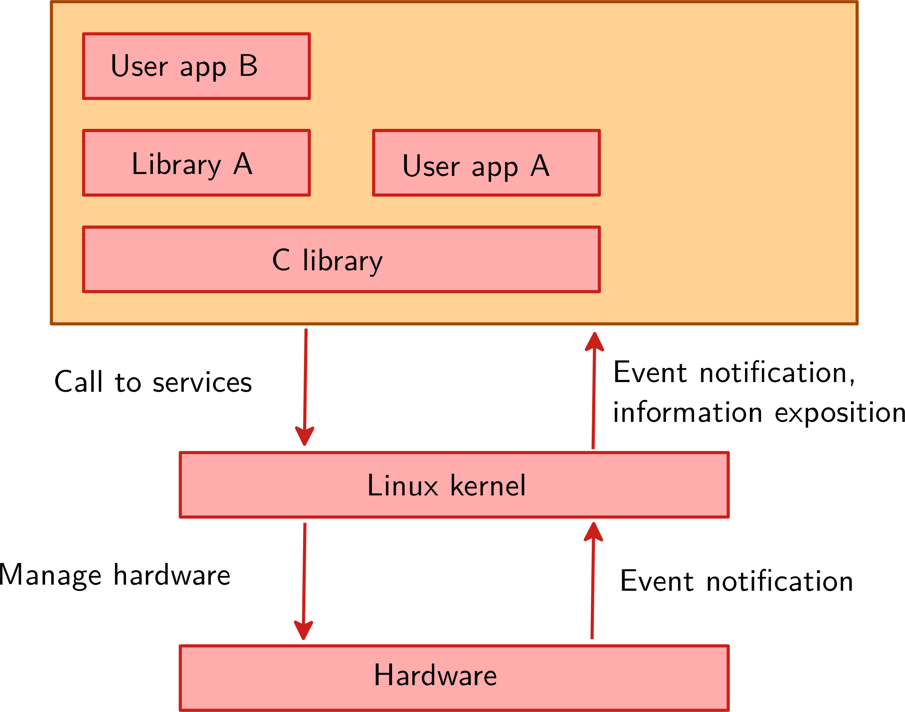
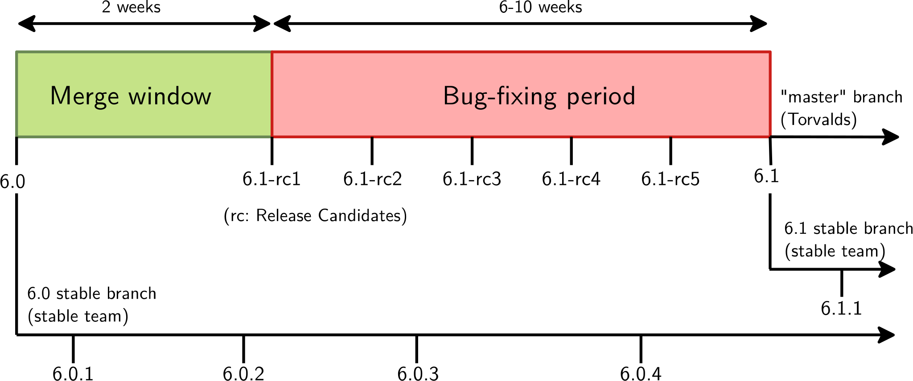

Linux内核
=====================

Linux内核的主要角色：

* `管理所有的硬件资源`：CPU、内存、I/O。
* 提供 `一组关于移植、体系架构和硬件的独立接口`，从而允许用户空间的应用和库使用硬件资源。
* 对来自不同的应用， `处理并发访问和使用`硬件资源。

.. tip:: 如：多个用户空间应用程序通过各种网络连接使用单个网络接口。内核要负责“多路复用（multiplexing）”硬件资源。

系统调用（System Call）：

* 内核与用户空间之间的主要接口是一组系统调用
* 大约有400个提供主要内核服务的系统调用
    * 如：文件和设备操作、网络操作、进程间通信、进程管理、内存映射、定时器、线程、同步指令...
* 系统调用接口由C库包装，用户空间应用通常从来不会直接进行系统调用，而是使用相应的C库函数

.. images::
    res/Linux_kernel_interfaces.svg

伪文件系统（Pseudo filesystems）：

* Linux让系统和内核信息在用户空间可通过伪文件系统访问，有时也称为虚拟文件系统。
* 伪文件系统允许应用查看并不存在于真实存储上的目录和文件：它们由内核凭空创建和更新。
* 两个最重要的伪文件系统：
    * proc，通常挂载在 /proc
        * 操作系统相关信息（进程、内存管理参数...）
    * sysfs，通常挂载在 /sys
        *  将系统表示为作为一颗由总线连接的设备树。内核框架管理这些设备，并收集信息。

Linux发展模型：

* 每个新的版本从一个为期两周的新功能merge窗口开始。
* 持续大约8个候选版本（每周一个）
* 直至采用一个新的官方版本

进一步稳定官方发行版：

* 问题：故障和安全修复仅合并到主分支中，需要更新到最新的内核才能受用。
* 解决方案：一只稳定的维护者团队会检查被合并到Torvald数中的所有补丁，并将相关补丁反向移植（backport）到它们的稳定分支中，持续至少几个月。

