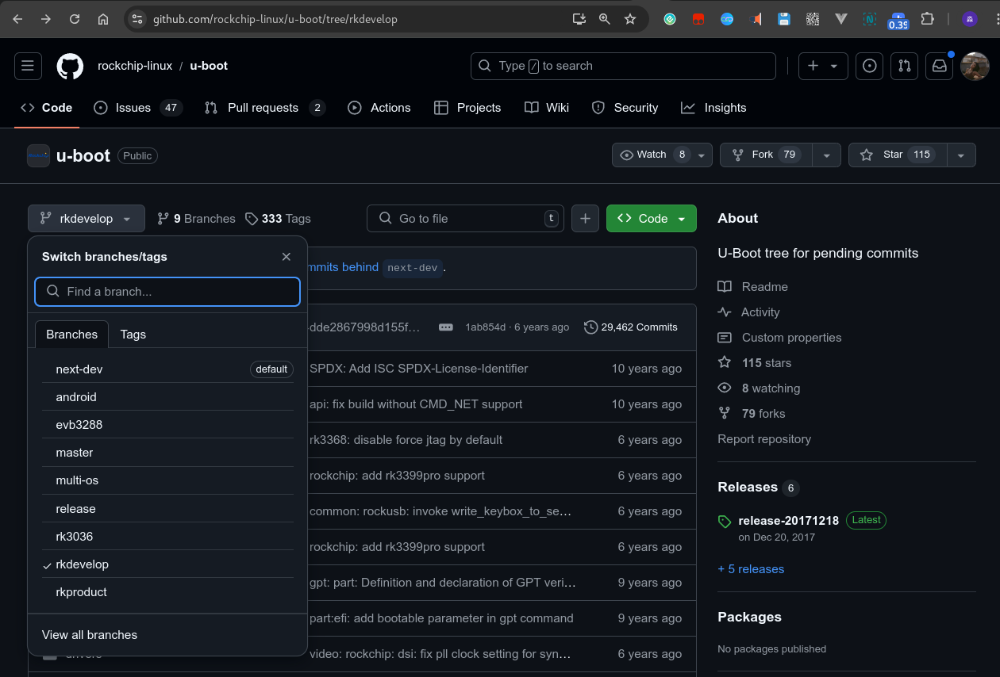

Rockchip对U-Boot所做的工作
========================================

工作目的
----------------------------------------

先大致弄清RK在U-Boot上干了哪些事，评估我去diff RK U-Boot到U-Boot主线的工作量。

资料整理
---------------------------------------

截止2024.09(RK在售旗舰仍为RK3588)，RK的U-Boot主要分为两个版本:

1. rkdevelop(v2014-10)

    代码已尘封，支持板子包括:

   * px30
   * pxm2
   * rk3036
   * rk3126
   * rk3128
   * rk3128x
   * rk322x
   * rk322xh
   * rk3288
   * rk3328
   * rk3366
   * rk3366-fpga
   * rk3368
   * rk3368-fpga
   * rk3368h
   * rk3399
   * rk3399-fpga
   * rk3399pro
  
    支持的功能有：

    1. 支持 Android 平台的固件启动；
    2. 支持 RockUSB 和 Google Fastboot 两种方式烧写；
    3. 支持 Secure boot 固件签名加密保护机制；
    4. 支持 LVDS、EDP、MIPI、HDMI、CVBS 等显示设备；
    5. 支持 SDCard、Emmc、Nand Flash、U 盘等存储设备；
    6. 支持开机 logo 显示、充电动画显示，低电管理、电源管理；
    7. 支持 I2C、SPI、PMIC、CHARGE、GUAGE、USB、GPIO、PWM、DMA、GMAC、EMMC、NAND 中断等驱动；
 
2. . next-dev(v2017-09)

    目前的开发主分支，支持板子包括：

   * px30
   * pxm2
   * rk1806
   * rk1808
   * rk3036
   * rk3126
   * rk3128
   * rk3128x
   * rk312x
   * rk322x
   * rk3288
   * rk3308
   * rk3326
   * rk3328
   * rk3368
   * rk3399
   * rk3399pro
   * rk3528
   * rk3562
   * rk3566
   * rk3568
   * rk3583
   * rk3588
   * rv1106
   * rv1126

RK自己承认了基于v2014-10所开发的U-Boot定制风比较强，当时的开发经验不足。

rkdevelop则是遵循上游开发规范，尽量走通用框架流程的分支。

使用RK芯片的系统启动流程:

Maskrom -> Pre-loader -> Trust -> U-Boot -> kernel -> Android

各部分职能：

* Pre-loader: 加载Trust和U-Boot。称为一级loader。闭源，以bin文件提供。
* U-Boot: 加载kernel。称为二级loader。

虽然Pre-loader闭源，但仍可以通过U-Boot的SPL/TPL功能来实现对其的替代。TPL负责DDR初始化，SPL负责加载和引导Trust和U-Boot模块。

注意:

1. rkdevelop仅支持Rockchip miniloader作为Pre-loader
2. next-dev支持Rockchip miniloader和SPL/TPL

分区支持
------------------------

rkdevelop:

1. 仅支持parameter.txt分区，不支持其他分区，同时解析其中的CMDLINE信息

next-dev:

1. 支持parameter.txt分区
2. 支持GPT分区
3. 为保持GPT和parameter.txt的一致性，推荐使用kernel dts的bootargs来自定义cmdline，不使用parameter.txt的CMDLINE

固件类型
----------------------------

打包格式上:

1. RK独立分区固件启动，boot Rockchip
2. AOSP格式启动，boot Android
3. FIT格式

boot路径上：

1. 基于网络 tftpboot、pxe boot
2. efi boot
3. aosp固件(Android AVB校验、A/B分区)

文件系统
----------------

1. fat
2. ext2/4

rkbin仓库放的什么？
---------------------------

存放的rk的bin文件和脚本工具

安全启动支持
----------------------------

支持AVB(Android)、FIT签名校验

