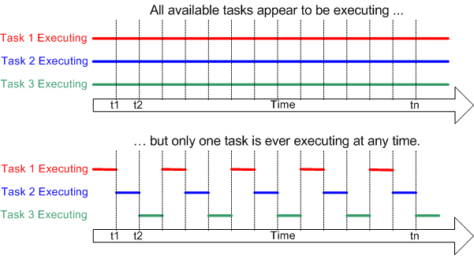
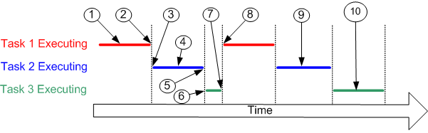
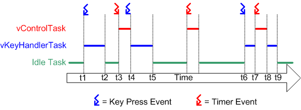

freertos
================================

常见问题
-----------------------------

为什么使用 RTOS？

您无需为编写良好的嵌入式软件而使用 RTOS。
不过，在某些时候，随着应用程序 大小增加或愈发复杂，RTOS 的服务可能会因为下文所列的一个或多个原因而变得有益。
这些并非绝对，只是参考意见。
与其他一切一样，为手头的任务选择合适的工具是任何项目中的重要第一步。
    
简而言之：

* 摘出定时信息

  * 实时调度器实际上只是一段代码，它使得您可以指定应用程序的定时特性，极大地简化、缩减应用程序代码（从而使其更便于理解）。

* 可维护性/可扩展性
  
  * 代码中不包含定时信息，可以提高可维护性和可扩展性，因为您的软件模块之间的相互依赖性会降低。
  * 更改一个模块不应影响另一个模块的时间行为（取决于任务的优先级划定）。
  * 软件也将不容易受到硬件变化的影响。
  * 例如，编写代码时可以 使其在时间上不受处理器频率变化（在合理范围内）的影响。

* 模块化

  * 将您的应用程序组织成一组自主任务，可以使模块化更有效。
  * 任务应该是松散耦合和功能内聚的单元，其内部按顺序执行。
  * 例如，无需将函数分解为微型状态机来防止它们需要过长时间才能执行完成。

* 接口更清晰

  * 定义明确的任务间通信接口有助于设计和团队开发。

* 测试更容易（在某些情况下）

  * 无需添加可能改变被测试模块行为的仪表，就可以执行任务接口 。

* 代码复用

  * 模块化程度提高，模块间的依赖度降低，便于项目间复用代码。
  * 任务本身有助于在项目中复用代码。
  * 以后者为例，假设一个应用程序从 TCP/IP 堆栈接收连接，则可以生成相同的任务代码来处理每个连接，每个连接使用一个任务。

* 效率是否会提高？

  * 使用 FreeRTOS 允许任务阻塞事件——无论是时间事件，还是系统外部事件。
  * 这意味着实际上没有事件需要处理时不会浪费时间轮询或检查定时器，从而大大节约对处理器的利用。
  * FreeRTOS 只会按需执行代码。但与之相反的是，您将需要运行 RTOS tick 并且需要花费时间在任务之间切换。
  * 节省的处理器时间是否超过开销取决于应用程序（反之亦然）。
  * 大多数应用程序都会运行某种形式的 tick，因此使用 tick 钩子函数可消除额外开销。

* 空闲时间

  * 使用 FreeRTOS.org 很容易测量处理器的负载。
  * 只要空闲任务正在运行，您就知道处理器无事可做。
  * 空闲任务还提供了一个非常简单的自动方法，将所述处理器设为低功耗模式。

* 中断处理灵活

  * 将中断触发的处理延迟到任务级别可以将中断处理程序的时间压缩到很短，并且在任务级别处理完成时让中断保持在启用状态。
  * 此外，任务级别的中断处理有助于灵活划定优先级，比使用硬件本身给每个外围设备分配优先级（取决于使用的架构）更灵活 。

* 混合处理要求

  * 简单的设计模式可以用于混合应用程序内的周期性、连续性和事件驱动的处理操作。
  * 此外，可以通过使用中断和任务优先级划定来满足软硬实时要求。

* 外围设备控制更容易

  * 守卫任务便于序列化对外围设备的访问，并提供良好的互斥机制。

* 其他益处。

.. note:: 什么是实时操作系统？
    
    阅读 FreeRTOS 教程书 对于解答这个问题很有帮助。
    请参阅"什么是 RTOS"页面，了解比本页更详细的解释 。
    实时操作系统是优化后用于嵌入式/实时应用程序的操作系统 。其主要目标在于确保对事件作出及时和确定的响应。
    此类 事件可以来自外部，如限位开关被触发，也可以来自内部，如接收到字符。
    使用实时操作系统，软件应用程序可以被编写为一组独立任务 。
    每个任务都被分配了优先级，而实时操作系统负责 确保正在运行的任务是能够运行的最高优先级任务。
    任务 何时可能无法运行的示例包括任务何时在等待外部事件发生， 或任务何时在等待一个固定时段。

.. note:: 什么是实时内核？

    请参阅"什么是 RTOS"页面，了解比本页更详细的解释 。
    实时操作系统可以为应用程序编写者提供许多资源，包括 TCP/IP 堆栈、文件系统等 。
    内核是操作系统中负责任务管理、任务间通信和同步的部分。 FreeRTOS 是一种实时内核。

.. note:: 什么是实时调度器？
    
    请参阅"什么是 RTOS"页面，了解比本页更详细的解释 。
    实时调度器和实时内核有时可互换使用。
    具体而言，实时调度器是 RTOS 内核中负责决定应执行哪个任务的部分。

.. note:: 如何使用 FreeRTOS？
    
    阅读一本 FreeRTOS 教程书对于解答这个问题很有帮助 。
    FreeRTOS 以源码形式提供。源代码应包含在您的应用程序项目中。 这样，您的应用程序源代码就可以使用公共 API 接口。
    使用 FreeRTOS 时，应用程序应被编写为一组独立的任务。
    这意味着您的 main() 函数不包含应用程序功能，而是创建应用程序任务， 然后启动 RTOS 内核。
    每个移植中的 main.c 和项目文件（makefile 或类似文件）就是很好的示例 。
    如需了解更多信息，请参阅创建新 FreeRTOS 应用程序页面 。

.. note:: 如何入门？

    请参阅 FreeRTOS 快速入门指南。

RTOS基础知识
--------------------------------

引言

实时操作系统 (RTOS) 是一种体积小巧、确定性强的计算机操作系统。
RTOS 通常用于需要在严格时间限制内对外部事件做出反应的嵌入式系统，如医疗设备和汽车电子控制单元 (ECU)。
通常，此类嵌入式系统中只有一两项功能需要确定性时序，即使嵌入式系统不需要严格的实时反应，使用 RTOS 仍能提供诸多优势。
请参阅常见问题：“为什么使用 RTOS？”。

RTOS 通常比通用操作系统体积更小、重量更轻，因此 RTOS 非常适用于内存、计算和功率受限的设备。

多任务处理

内核是操作系统的核心组件。
Linux 等通用操作系统采用的内核允许多个用户看似同时访问计算机的处理器。
这些用户可以各自执行多个程序，看起来像是并发运行。

每个执行的程序由操作系统控制下的一个或多个线程实现。
如果操作系统能够以这种方式执行多个线程，则称为多任务处理。
像 FreeRTOS 这样的小型 RTOS 通常将线程称为任务，因为它们不支持虚拟内存，因此进程和线程之间没有区别。

使用多任务操作系统可以简化原本复杂的软件应用程序的设计：

* 操作系统的多任务处理和任务间通信功能允许将复杂的应用程序划分为一组更小且更易于管理的任务。

* 这种划分可以简化软件测试，确保团队分工明确，并促进代码复用。

* 复杂的时序和排序细节将由 RTOS 内核负责，从而减轻了应用程序代码的负担。

有关更全面的列表，请参阅常见问题：“为什么使用 RTOS？”。

多任务处理与并发

常规单核处理器一次只能执行一个任务，但多任务操作系统可以快速切换任务，使所有任务看起来像是同时在执行。
下图展示了三个任务相对于时间的执行模式。
任务名称用不同颜色标示，并写在左侧。
时间从左向右移动，彩色线条显示在特定时间执行的任务。
上方展示了所感知的并发执行模式，下方展示了实际的多任务执行模式。

调度

调度器是内核中负责决定在特定时间应执行什么任务的部分。
内核可以在任务的生命周期内多次暂停并恢复该任务。
如果任务 B 取代任务 A 成为当前执行的任务 （即任务 A 暂停，任务 B 恢复），我们就可以称任务 A “换出”，任务 B “换入”。

调度策略是调度器用来决定何时执行哪个任务的算法。
在（非实时）多用户系统中，调度策略通常会确保每个任务获得“公平”的处理器时间。
实时嵌入式系统中使用的策略详见下文。

只有当调度算法决定执行不同的任务时，任务才会换出。
这种切换可能在当前执行的任务不知情的情况下发生，例如调度算法响应外部事件或定时器到期时；
还可能发生在执行任务显式调用某个导致其让出、休眠（也称为延迟）或阻塞的 API 函数时。

如果某任务让出，调度算法可能会再次选择同一任务执行。
如果某任务休眠，则在指定的延迟时间到期前不可被选择。
同样，如果某任务阻塞，则在特定事件发生（例如，数据到达 UART）或超时期满之前将不可被选择。

操作系统内核负责管理这些任务状态和转换，确保根据调度算法和每个任务的当前状态在给定时间选择适当的任务执行。

参考上图中的数字标记：

* 在标记 (1) 处，任务 1 正在执行。
* 在标记 (2) 处，内核将任务 1 换出……
* ……并在标记 (3) 处将任务 2 换入。
* 在任务 2 执行期间，在标记 (4) 处，任务 2 锁定了处理器外设以进行独占访问（图中不可见）。
* 在标记 (5) 处，内核将任务 2 换出……
* ……并在标记 (6) 处将任务 3 换入。
* 任务 3 试图访问之前被任务 2 锁定的处理器外设，发现其被锁定，在标记 (7) 处阻塞以等待外设解锁。
* 在标记 (8) 处，内核将任务 1 换入。
* 如此往复。
* 在标记 (9) 处，任务 2 再次执行，完成对外设的操作并解锁。
* 在标记 (10) 处，任务 3 再次执行，发现外设可用，继续执行直到再次被换出。

实时调度

实时操作系统 (RTOS) 利用与通用（非实时）系统相同的原理来实现多任务处理， 但两者的目标截然不同。
这一差异主要体现在调度策略上。
实时嵌入式系统旨在对现实世界的事件作出及时响应。
这些事件通常有截止时间，实时嵌入式系统必须在此之前响应，RTOS 调度策略必须确保遵守这些截止时间要求。

为在小型 RTOS（如 FreeRTOS）中实现这一目标，软件工程师必须为每个任务分配优先级。
RTOS 的调度策略就是确保能够执行的最高优先级任务获得处理时间。
如果存在多个能够运行的同等最高优先级任务（既没有延迟也没有阻塞），则调度策略可以选择在这些任务之间“公平”地分配处理时间。

这种基本形式的实时调度并非万能，无法改变时间的快慢，应用程序编写者必须确保设定的时序约束在所选任务优先级安排下是可行的。

示例

以下为最基本的示例，涉及一个带有键盘、LCD 和控制算法的实时系统。

用户每次按键后，必须在合理的时间内获得视觉反馈，如果用户在此期间无法看到按键已被接受，则该软件产品的使用感会很差（软实时）。
如果最长可接受的响应时间是 100 毫秒，则任何介于 0 和 100 毫秒之间的响应都是可接受的。
此功能可作为自主任务实现，结构如下：

::

  void vKeyHandlerTask( void *pvParameters )
  {
      // Key handling is a continuous process and as such the task
      // is implemented using an infinite loop (as most real-time
      // tasks are).
      for( ;; )
      {
          [Block to wait for a key press event]
          [Process the key press]
      }
  }

现在假设实时系统还在执行依赖于数字滤波输入的控制功能。
输入必须 每 2 毫秒采样一次、滤波一次并执行控制周期。
为了正确操作滤波器，采样时间必须精确到 0.5 毫秒。
此功能可作为自主任务实现，结构如下：

::

  void vControlTask( void *pvParameters )
  {
      for( ;; )
      {
          [Delay waiting for 2ms since the start of the previous cycle]
          [Sample the input]
          [Filter the sampled input]
          [Perform control algorithm]
          [Output result]
      }
  }

软件工程师必须为控制任务分配最高优先级，因为：

1. 控制任务的截止时间比按键处理任务更严格。
2. 错过截止时间对控制任务的后果比对按键处理任务更严重。

下图演示了实时操作系统如何调度这些任务。
RTOS 会自行创建一个任务，即空闲任务，仅当没有其他任务能够执行时，该任务才会执行。
RTOS 空闲任务总是处于可以执行的状态。

请参阅上图：

* 起初，两个任务都不能运行：vControlTask 等待合适的时间来开始新的控制周期， 而 vKeyHandlerTask 则在等待按键操作。
  处理器时间分配给了 RTOS 空闲任务。

* 在时间 t1 处，发生按键事件。
  vKeyHandlerTask 可以执行，其优先级高于 RTOS 空闲任务， 因此获得了处理器时间。

* 在时间 t2 处，vKeyHandlerTask 已完成按键处理并更新 LCD。
  在按下另一个键之前该任务无法继续执行，因此将自己挂起，RTOS 空闲任务恢复执行。

* 在时间 t3 处，定时器事件指示执行下一个控制循环的时间到了。
  vControlTask 现在可以执行， 因为优先级最高的任务被立刻分配了处理器时间。

* 在时间 t3 和 t4 之间，vControlTask 仍在执行时，发生了按键事件。
  vKeyHandlerTask 可以执行， 但由于其优先级低于 vControlTask，因此未获得任何处理器时间。

* 在 t4 处， vControlTask 完成了控制周期的处理，并且直到下一次定时事件的发生前不能重新开始运行，进入阻塞态。
  vKeyHandlerTask 现在成为可以运行的最高优先级的任务， 因此获得处理器时间以处理先前的按键事件。

* 在 t5 处，按键事件处理完成，并且 vKeyHandlerTask 进入阻塞态等待下一次按键事件。
  再一次， 两个任务都未进入就绪态，RTOS 空闲任务获得处理器时间。

* 在 t5 与 t6 之间，定时事件发生并处理，没有进一步的按键事件发生。

* 在 t6 处发生按键事件，但在 vKeyHandlerTask 完成按键处理之前，发生了定时事件。
  此时两个任务都可以执行。
  由于 vControlTask 具有更高的优先级， 因此 vKeyHandlerTask 在完成按键操作之前被挂起，vControlTask 获得处理器时间。

* 在 t8 处，vControlTask 完成控制周期的处理，然后进入阻塞态等待下一次事件。
  vKeyHandlerTask 再次 成为运行的最高优先级任务，因此获得处理器时间，以便完成按键处理 。

FreeRTOS 内核快速入门指南
---------------------------------

本页面首先介绍如何尽快在目标设备上运行 RTOS 。
下文“后续步骤 — 延伸阅读”部分提供了一组 链接，可帮助您加深对 FreeRTOS 的了解，获得常见问题的解答，并且更熟练地使用 FreeRTOS。

另请参阅简单 FreeRTOS 项目入门文档， 为获得更出色的入门体验，也请参阅相关 FreeRTOS 书籍。
我们还提供了 FreeRTOS 移植 （适用于 Windows 和 Linux） 以及 QEMU 项目，供您通过免费工具尝试使用 FreeRTOS， 这些工具对硬件没有任何特殊要求。

入门建议

无论您是刚接触 FreeRTOS，还是已经具有丰富的开发经验，我们始终建议您在开发新项目时，先定义 configASSERT()， 实现 malloc 失败钩子函数，并将 configCHECK_FOR_STACK_OVERFLOW 设置为 2。

RTOS 快速入门说明

FreeRTOS 已移植到许多不同的架构和编译器。
每个 RTOS 移植都附带预配置的演示应用程序，可助您快速开始使用。
此外，每个演示应用程序还配有相应的文档页面，提供的信息非常全面，包括如何找到 RTOS 演示项目源代码、构建演示项目以及配置目标硬件。

演示应用程序文档页面还提供基本的 RTOS 移植特定信息，包括如何编写与 FreeRTOS 兼容的中断服务程序。
这些内容在不同的微控制器架构上可能会略有不同。

按照以下简单说明，几分钟内即可开始运行：

1. 下载 RTOS 源代码：
   
   RTOS 库可通过 Git 分别获取，但最简单的入门方式是下载 FreeRTOS .zip 文件，因为该文件中还包含针对各官方移植的演示项目。请不要被文件数量吓到，实际上，每个演示只需要其中一小部分文件！将文件解压到您认为合适的目录中。

2. 找到相关文档页面：
   
   在“支持的设备”页面中，查看 FreeRTOS 官方支持的微控制器供应商名单。
   点击微控制器供应商名称，即可跳转至针对该供应商的文档页面列表。
   
   如果没有针对您所用开发板的预配置移植，请参阅修改演示应用程序以在其他硬件上运行页面。

3. 构建项目：
   
   按照 RTOS 移植文档页面上的说明，在 FreeRTOS 目录结构中找到所需的项目，然后打开并构建演示项目。

4. 运行演示应用程序：
   
   按照 RTOS 移植文档页面上的说明设置目标硬件、下载并执行演示应用程序。该文档页面还提供有关演示应用程序功能的信息，助您判断该应用程序是否正确执行。

5. 创建您自己的项目：
   
   要创建自己的 FreeRTOS 项目，最简单的方法是以您所选移植配套的演示应用程序为基础来进行构建。演示应用程序开始运行后，逐渐删除演示函数和源文件，并替换为您自己的应用程序代码。 如在排查故障时需要帮助，请参阅常见问题：“我的应用程序无法运行，问题可能出在哪里？”。

延伸阅读

要创建自己的 FreeRTOS 项目，最简单的方法是以您所选移植配套的演示应用程序为基础来进行构建。
演示应用程序开始运行后，逐渐删除演示函数和源文件，并替换为您自己的应用程序代码。

专业开发者可利用以下链接快速找到有用信息：

* 下载 FreeRTOS 书籍和手册。
* 了解 FreeRTOS 目录结构。
* RTOS 演示应用程序项目简介。
* 修改 RTOS 演示应用程序以在其他硬件上运行。
* 了解 FreeRTOS 许可证。
* 常见问题：我的应用程序无法运行，问题可能出在哪里？
* 使用 configASSERT() 捕获用户错误
* 获取免费支持external_link。
* 获取商业许可证和开发服务

源码组织
------------------------

简介

每个 RTOS 移植都附有一个预配置的演示应用程序，该应用程序已构建必要的 RTOS 源文件，并包含必要的 RTOS 头文件。
强烈建议将所提供的演示程序作为所有基于 FreeRTOS 的新应用程序的基础。
此页面旨在帮助查找和了解所提供的项目。

基本目录结构

FreeRTOS 下载文件包括每个处理器移植和每个演示应用程序的源代码。
将所有移植放在一个单一的下载包中，大大简化了发布工作，但文件数量可能看起来令人生畏。
然而，目录结构非常简单，FreeRTOS 实时内核仅包含在 3 个文件中（如需要软件定时器、 事件组或协程功能，则需要其他文件）。

从顶部开始，下载被分割成两个子目录：FreeRTOS 和 FreeRTOS-Plus。如下所示：

::

  +-FreeRTOS-Plus    Contains [FreeRTOS-Plus](/Documentation/03-Libraries/02-FreeRTOS-plus/01-Introduction) components and demo projects.
  |
  +-FreeRTOS         Contains the FreeRTOS real time kernel source
                    files and demo projects

FreeRTOS-Plus 目录树包含多个描述其内容的自述文件。

FreeRTOS 内核目录结构

核心 FreeRTOS 内核源文件和演示项目包含在两个子目录中，如下所示：

::

  FreeRTOS
      |
      +-Demo      Contains the demo application projects.
      |
      +-Source    Contains the real time kernel source code.

核心 RTOS 代码包含在三个文件中，分别称为 task.c、queue.c 和 list.c。 
这三个文件位于 FreeRTOS/Source 目录中。
同一目录包含两个名为 timers.c 和 croutine.c 的可选文件，分别实现软件计时器和协程功能。

每个受支持的处理器架构都需要少量的架构特定 RTOS 代码。
这是 RTOS 可移植层，位于 FreeRTOS/Source/Portable/[compiler]/[architecture] 子目录，其中 [compiler] 和 [architecture] 分别是用于创建移植的编译器和移植运行的架构。

出于内存管理页面上所述的原因，示例堆分配方案也位于可移植层中。
各种示例 heap_x.c 文件位于 FreeRTOS/Source/portable/MemMang 目录中。

可移植层目录示例：

* 如果将 TriCore 1782 移植与 GCC 编译器一起使用：
  
  TriCore 特定文件 (port.c) 位于 FreeRTOS/Source/Portable/GCC/TriCore_1782 目录中。 除 FreeRTOS/Source/Portable/MemMang 外，所有其他 FreeRTOS/Source/Portable 子目录 都可以忽略或删除。

* 如果将 Renesas RX600 移植与 IAR 编译器一起使用：

  RX600 特定文件 (port.c) 位于 FreeRTOS/Source/Portable/IAR/RX600 目录中。除 FreeRTOS/Source/Portable/MemMang 外，所有其他 FreeRTOS/Source/Portable 子目录 都可以忽略或删除。

* 所有移植都是如此......

FreeRTOS/Source 目录的结构如下所示。

::

  FreeRTOS
      |
      +-Source        The core FreeRTOS kernel files
          |
          +-include   The core FreeRTOS kernel header files
          |
          +-Portable  Processor specific code.
              |
              +-Compiler x    All the ports supported for compiler x
              +-Compiler y    All the ports supported for compiler y
              +-MemMang       The sample heap implementations

FreeRTOS 下载还包含每个处理器架构和编译器移植的演示应用程序 。
大多数演示应用程序代码对所有移植都通用，位于 FreeRTOS/Demo/Common/Minimal 目录中（位于 FreeRTOS/Demo/Common/Full 目录下的是历史遗留代码，仅用于 PC 移植）。

其余的 FreeRTOS/Demo 子目录包含用于构建单个 演示应用程序的预配置项目。子目录的命名与移植平台和编译器相关。每个 RTOS 移植 都有自己的网页， 详细说明了该移植演示应用程序所在的目录。

演示目录示例：

如果构建的 TriCore GCC 演示应用程序面向 Infineon TriBoard 硬件：

TriCore 演示应用程序项目文件位于 FreeRTOS/Demo/TriCore_TC1782_TriBoard_GCC 目录中。FreeRTOS/Demo 目录下的所有子目录（Common 目录除外） 都可以忽略或删掉。

如果构建的 RenesasRX6000IAR 演示应用程序面向 RX62N RDK 硬件：

IAR 工作区文件位于 FreeRTOS/Demo/RX600_RX62N-RDK_IAR 目录中。所有其他 FreeRTOS/Demo 目录下的所有子目录（Common 目录除外） 都可以忽略或删除。

所有移植都是如此......

FreeRTOS/Demo 目录的结构如下所示。

::

  FreeRTOS
      |
      +-Demo
          |
          +-Common    The demo application files that are used by all the demos.
          +-Dir x     The demo application build files for port x
          +-Dir y     The demo application build files for port y

创建您自己的应用程序

[更多详细信息请参阅创建新的 FreeRTOS 应用程序页面]

提供预配置的演示应用程序，以确保项目已经存在，其中包括正确的 RTOS 内核源文件，并设置了正确的编译器选项，从而最大限度地减少用户的工作量。
因此，强烈建议通过修改现有的预配置演示应用程序来创建新应用程序。
首先构建现有的演示应用程序，确保可以实现干净的构建，然后在 FreeRTOS/Demo 目录中将项目中包含的文件逐渐替换为自己的应用程序源文件。

FreeRTOS MPS2 QEMU 演示 (Arm Cortex-M3) 适用于 IAR 和 arm-none-eabi-gcc 编译器（makefile 和 Eclipse）
-----------------------------------------------------------------------------------------------------------------

本页记录了一个 FreeRTOS 内核演示，面向 Arm Cortex-M3 mps2-an385 QEMUexternal_link 模型，还针对 IAR Embedded Workbenchexternal_link 和 arm-none-eabi-gccexternal_link (GNU GCC) 编译器提供了预配置的构建项目。GCC 项目使用简单的 makefile， 可通过命令行或提供的 Eclipse CDT IDEexternal_link 项目构建。

.. important:: 重要！QEMU Cortex-M3 RTOS 演示使用说明

使用此 RTOS 移植前，请阅读下述所有要点。

1. 源代码组织
2. 演示应用程序
3. RTOS 配置和使用详情

另请参阅常见问题中的“我的应用程序无法运行，问题可能出在哪里？”， 请特别注意，建议在开发过程中定义 configASSERT() （在 FreeRTOSConfig.h 中定义），并将 configCHECK_FOR_STACK_OVERFLOW 设置为 2。

源代码组织

本网站提供的 FreeRTOS 发行版包含所有 FreeRTOS 移植的源文件，以及所有 FreeRTOS 演示应用程序的项目。
因此，它所包含的文件数量远多于使用 Cortex-M3 mps2-an385 QEMU 演示所需的文件数量。
请参阅源代码组织部分，获取目录结构介绍以及创建 新 FreeRTOS 项目的信息。

mps2-an385 演示应用程序的 IAR Embedded Workbench for ARM 工作区名为 RTOSDemo.eww，位于 FreeRTOS/Demo/CORTEX_MPS2_QEMU_IAR_GCC/build/iar 目录中。

使用 arm-none-eabi-gcc (GNU GCC) 编译器构建项目的 makefile 和 构建相同 makefile 的 Eclipse 项目都位于 FreeRTOS/Demo/CORTEX_MPS2_QEMU_IAR_GCC/build/gcc 目录中。

mps2-an385 Arm Cortex-M3 QEMU 演示应用程序

功能

演示项目提供了简单的 blinky 和全面的测试/演示配置， 详见 FreeRTOS 演示应用程序 文档页面。
针对本页所记录的演示，"check" 任务 会定期按以下格式打印信息：

::

  StatusMessageString : aaaa (bb)

其中 StatusMessageString 是描述性文本字符串，aaaa 是 RTOS 滴答 计数，bb 是应用程序检测到中断嵌套的 次数。

构建并执行演示应用程序 - IAR

1. 打开 FreeRTOS/Demo/CORTEX_MPS2_QEMU_IAR_GCC/build/iar/RTOSDemo.eww （位于 IAR Embedded Workbench IDE）。

2. 打开 main.c，并设置 mainCREATE_SIMPLE_BLINKY_DEMO_ONLY， 根据需要生成简单的 blinky 演示或全面的测试和演示应用程序 。

3. 从 IDE 的 "Project" 菜单中选择 "Rebuild All"， 构建 RTOS 演示项目时，不应出现任何错误或警告。 成功构建后， 会创建 elf 文件 FreeRTOS/Demo/CORTEX_MPS2_QEMU_IAR_GCC/build/iar/Debug/Exe/RTOSDemo.out。
   
   **注意：** 如果 QEMU 已在运行，则构建将失败，因为 QEMU 会阻止 覆盖生成的 elf 文件。 

4. 确保主机上已安装 QEMU。 

5. 使用以下命令行启动 QEMU，将 [path-to] 替换为 IAR 构建生成的 RTOSDemo.out 文件的正确路径。

  QEMU 命令行

  ::
    
    qemu-system-arm -machine mps2-an385 -cpu cortex-m3 -kernel [path-to]/RTOSDemo.out -monitor none -nographic -serial stdio -s -S  

  如果只是 希望在 QEMU 中运行 FreeRTOS 应用程序，而不连接调试器， 请省略 "-s -S"。 

6. 构建完成后，从 IDE 的 "Project" 菜单中选择 "Download and Debug" 。
   IAR 调试器即会创建与 QEMU 的 GDB 连接， 启动调试会话，并在进入 main() 函数时中断。

**注意：**请记住在调试会话结束时终止 QEMU 会话， 否则 QEMU 将阻止 在下次构建 IAR 项目时覆盖可执行映像， 从而导致链接器错误。

构建并执行演示应用程序 - GCC Makefile

1. 确保主机上已安装 arm-none-eabi-gccexternal_link 编译器和 GNU make 实用程序 。

2. 打开 FreeRTOS/Demo/CORTEX_MPS2_QEMU_IAR_GCC/main.c，并设置 mainCREATE_SIMPLE_BLINKY_DEMO_ONLY， 根据需要生成简单的 blinky 演示或全面的测试和演示应用程序 。

3. 打开命令提示符并导航到 FreeRTOS/Demo/CORTEX_MPS2_QEMU_IAR_GCC/build/gcc 目录。
   
4. 在命令提示符中键入 "make"。构建项目时， 不应出现任何编译器错误或警告。
   提示：使用 "-j" 参数， 可在主机上使用更多核心，进而加快编译速度。
   例如， 如果有四个核心可用， 则输入 "make -j4" 可同时构建四个 C 文件。
   成功构建后， 会创建 elf 文件 FreeRTOS/Demo/CORTEX_MPS2_QEMU_IAR_GCC/build/gcc/output/RTOSDemo.out。

5. 确保主机上已安装 QEMU。
   
6. 使用以下命令行启动 QEMU，将 [path-to] 替换为 GCC 构建生成的 RTOSDemo.out 文件的正确路径。

  QEMU 命令行

  :: 
    
    qemu-system-arm -machine mps2-an385 -cpu cortex-m3 -kernel [path-to]/RTOSDemo.out -monitor none -nographic -serial stdio -s -S  

  如果只是 希望在 QEMU 中运行 FreeRTOS 应用程序，而不连接调试器， 请省略 "-s -S"。

7. 现在，可使用 arm-none-eabi-gdb 启动命令行调试会话，不过我更倾向于启动图形调试会话， 步骤如下，这适用于使用 Eclipse IDE 的用户。

构建并执行演示应用程序 - Eclipse

1. 确保主机上已安装 arm-none-eabi-gccexternal_link 编译器和 Eclipse CDT IDEexternal_link 。如果 Eclipse 中未包含 GNU make 实用程序，则可能需要单独安装。
   
2. 从 Eclipse 的 "File" 菜单中选择 "Import"， 在出现的窗口中选择 "Existing Projects Into Workspace"，然后单击 "Next" 按钮。
[!](/media/2021/import-vanilla-eclipse.jpg) 

3. 在下一个窗口中，选择 /FreeRTOS/Demo/CORTEX_MPS2_QEMU_IAR_GCC/build/gcc 作为根目录，勾选 FreeRTOSDemo 项目， 务必不要勾选 "Copy projects into workspace" 复选框，然后单击 "Finish" 按钮，即可将项目导入 Eclipse。

[!](/media/2021/import-project-vanilla-eclipse.jpg) 4. 打开 main.c，并设置 mainCREATE_SIMPLE_BLINKY_DEMO_ONLY， 根据需要生成简单的 blinky 演示或全面的测试和演示应用程序 。 5. 从 Eclipse 的 "Project" 菜单中选择 "Build All"。成功构建后， 会创建 elf 文件 FreeRTOS/Demo/CORTEX_MPS2_QEMU_IAR_GCC/build/gcc/output/RTOSDemo.out。 6. 确保主机上已安装 QEMU。 7. 打开命令提示符，然后使用以下命令行启动 QEMU， 将 [path-to] 替换为 GCC 构建生成的 RTOSDemo.out 文件的正确路径。

qemu-system-arm -machine mps2-an385 -cpu cortex-m3 -kernel [path-to]/RTOSDemo.out -monitor none -nographic -serial stdio -s -S  

QEMU 命令行

如果只是 希望在 QEMU 中运行 FreeRTOS 应用程序，而不连接调试器， 请省略 "-s -S"。 8. 单击绿色 bug speed 按钮旁边的小箭头，然后从出现的菜单中选择 "Debug Configurations..."。

[!](/media/2021/debug-configurations-vanilla-eclipse.jpg) 9. 在 Debug Configurations 窗口中，从 "GDB Hardware Debugging" 下选择 "FreeRTOSDemo Default"， 然后单击 "Debug" 按钮。Eclipse 调试器即会创建与 QEMU 的 GDB 连接， 启动调试会话，并在进入 main() 函数时中断。

[!](/media/2021/debug-configuration-selected-vanilla-eclipse.jpg)

RTOS 配置和使用详情

ARM Cortex-M3 RTOS 移植特定配置

此演示特定的配置项位于 FreeRTOS/Demo/CORTEX_MPS2_QEMU_IAR_GCC/FreeRTOSConfig.h 中。 
您可以编辑此文件中定义的常量，确保适配您的应用程序。尤其是以下常量：

* configTICK_RATE_HZ
  
  此常量可用于设置 RTOS 滴答中断的频率。提供的值 (1000 Hz) 对于 测试 RTOS 内核功能非常有用，但此频率比大多数应用程序所需的频率都要高。 降低频率可提高生产应用程序的效率， 但会导致综合测试中的自检失败。

* configKERNEL_INTERRUPT_PRIORITY 和 configMAX_SYSCALL_INTERRUPT_PRIORITY
  
  有关这些配置常量的完整信息，请参阅 RTOS 内核配置文档。 请注意，QEMU 模型有 8 个中断优先级位。

请注意！请参阅专门介绍如何在 ARM Cortex-M 设备上设置中断优先级的页面。
请记住，ARM Cortex-M 核心中，数字越小，中断优先级越高。这似乎有悖直觉，而且很容易忘记！
如果希望 为中断分配低优先级，请勿将其优先级指定为 0（或其他较小数值）， 因为这实际上可能会导致该中断在系统中具有最高优先级，因此，如果此优先级 高于 configMAX_SYSCALL_INTERRUPT_PRIORITY，则可能导致系统崩溃。
另外，请勿忘记分配中断优先级，因为默认情况下，中断优先级为 0， 这可能导致其处于最高优先级。

ARM Cortex-M 核心的最低优先级实际上是 255，但是不同的 ARM Cortex-M 微控制器制造商实现的优先级位数不同，并且提供的库函数要求以不同的方式指定优先级。
例如， ST STM32F7 ARM Cortex-M7 微控制器上可以指定的最低优先级实际上为 15，这是由 FreeRTOSConfig.h 中的常量 configLIBRARY_LOWEST_INTERRUPT_PRIORITY 定义的。
可指定的最高优先级始终为零。

我们还建议确保将所有优先级位指定为抢占式优先级位，不要将任何优先级位指定为子优先级位。

每个移植都将 "BaseType_t" 定义为对该处理器而言最有效的数据类型。
此移植将 BaseType_t 定义为长类型。

中断服务程序

与许多 FreeRTOS 移植不同的是，引发上下文切换的中断服务程序无特殊要求，可根据编译器文档编写。
宏 portEND_SWITCHING_ISR()（或 portYIELD_FROM_ISR()）可用于 在中断服务程序内请求上下文切换。

请注意，portEND_SWITCHING_ISR() 将启用中断。

下列源代码片段仅作为示例提供。中断 使用直达任务通知与任务（未显示）同步，并调用 portEND_SWITCHING_ISR 以确保中断直接返回任务。

::

  void Dummy_IRQHandler(void)
  {
  long lHigherPriorityTaskWoken = pdFALSE;

      /* Clear the interrupt if necessary. */
      Dummy_ClearITPendingBit();

      /* This interrupt does nothing more than demonstrate how to synchronise a
  task with an interrupt. A task notification is used for this purpose. Note
  lHigherPriorityTaskWoken is initialised to zero. */
      [vTaskNotifyGiveFromISR()](/Documentation/02-Kernel/04-API-references/05-Direct-to-task-notifications/02-vTaskNotifyGiveFromISR)( xTaskToNotify, &lHigherPriorityTaskWoken );

      /* If the task with handle xTaskToNotify was blocked waiting for the notification
  then sending the notification will have removed the task from the Blocked
  state. If the task left the Blocked state, and if the priority of the task
  is higher than the current Running state task (the task that this interrupt
  interrupted), then lHigherPriorityTaskWoken will have been set to pdTRUE
  internally within vTaskNotifyGiveFromISR(). Passing pdTRUE into the
  portEND_SWITCHING_ISR() macro will result in a context switch being pended to
  ensure this interrupt returns directly to the unblocked, higher priority,
  task. Passing pdFALSE into portEND_SWITCHING_ISR() has no effect. */
      portEND_SWITCHING_ISR( lHigherPriorityTaskWoken );
  }

只有以 "FromISR" 结尾的 FreeRTOS API 函数才能 从中断服务程序中调用，并且中断的优先级必须小于或等于 configMAX_SYSCALL_INTERRUPT_PRIORITY 配置常量（或 configLIBRARY_MAX_SYSCALL_INTERRUPT_PRIORITY）设置的优先级。

FreeRTOS 使用的资源

FreeRTOS 需要独占 SysTick 和 PendSV 中断，使用 SVC 编号 #0。

在抢占式和协同式 RTOS 内核之间切换

在 FreeRTOSConfig.h 中将 configUSE_PREEMPTION 设置为 1，即可使用抢占式调度；设置为 0， 即可使用协同式调度。
选择协同式 RTOS 调度器时，完整的演示应用程序可能无法正确执行。

编译器选项

与所有移植一样，使用正确的编译器选项至关重要。要确保这一点， 最佳方法是基于提供的演示应用程序文件构建应用程序。

内存分配

ARM Cortex-M7 演示应用程序项目中包含的 Source/Portable/MemMang/heap_4.c 可用于提供 RTOS 内核所需的内存分配。
请参阅 API 文档的内存管理部分， 以获取完整信息。

其他事项

请注意，vPortEndScheduler() 尚未实现。

