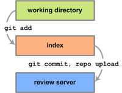
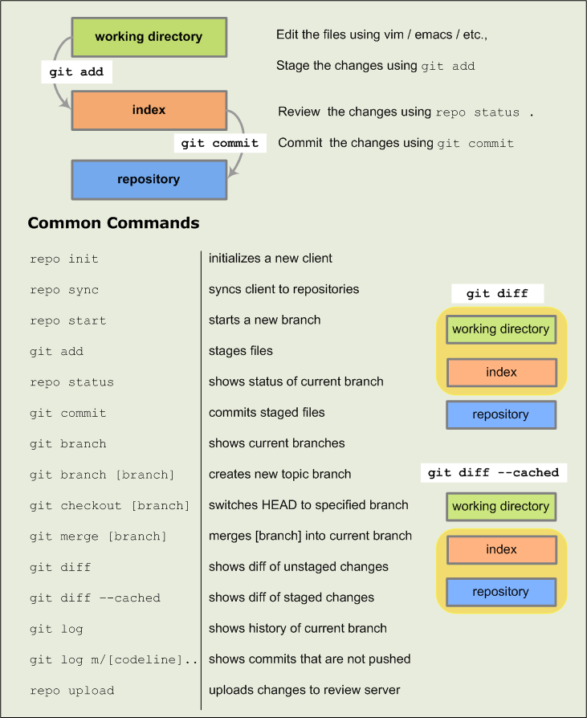

repo基本教程
============================

要处理 Android 代码，您需要同时使用 Git 和 Repo。在大多数情况下，您可以仅使用 Git（不必使用 Repo），或结合使用 Repo 和 Git 命令以组成复杂的命令。不过，使用 Repo 执行基本的跨网络操作可大大简化您的工作。

**Git** 是一个开放源代码的版本控制系统，专用于处理分布在多个代码库上的大型项目。在 Android 环境中，我们会使用 Git 执行本地操作，例如建立本地分支、提交、查看更改、修改。打造 Android 项目所面临的挑战之一就是确定如何最好地支持外部社区 - 从业余爱好者社区到生产大众消费类设备的大型原始设备制造商 (OEM)。我们希望组件可以替换，并希望有趣的组件能够在 Android 之外自行发展。我们最初决定使用一种分布式修订版本控制系统，经过筛选，最后选中了 Git。

**Repo** 是我们以 Git 为基础构建的代码库管理工具。Repo 可以在必要时整合多个 Git 代码库，将相关内容上传到我们的修订版本控制系统，并自动执行 Android 开发工作流程的部分环节。Repo 并非用来取代 Git，只是为了让您在 Android 环境中更轻松地使用 Git。Repo 命令是一段可执行的 Python 脚本，您可以将其放在路径中的任何位置。使用 Android 源代码文件时，您可以使用 Repo 执行跨网络操作。例如，您可以借助单个 Repo 命令，将文件从多个代码库下载到本地工作目录。

**Gerrit** 是一个基于网页的代码审核系统，适用于使用 Git 的项目。Gerrit 允许所有授权用户提交更改（如果通过代码审核，这些更改会自动纳入项目中），以此鼓励他们更集中地使用 Git。此外，Gerrit 可以在浏览器中并排显示更改，并支持代码内注释，使得审核工作变得更轻松。

**Android Studio** 是用于开发 Android 应用的官方集成开发环境 (IDE)。如需了解详情，请参阅 Android Studio 概览。

基本工作流程
--------------------------

图 1. Android 基本工作流程

与代码库进行交互的基本模式如下：

1. 使用 *repo start* 新建一个主题分支。

2. 修改文件。

3. 使用 *git add* 暂存更改。

4. 使用 *git commit* 提交更改。

5. 使用 *repo upload* 将更改上传到审核服务器。

任务参考
----------------------

以下任务列表简要总结了如何执行常见的 Repo 和 Git 任务。要了解如何使用 Repo 下载源代码，请参阅下载源代码和使用 Repo。

同步客户端
-------------------------

要同步所有可用项目的文件，请运行以下命令：

::

    $ repo sync

要同步所选项目的文件，请运行以下命令：

::

    $ repo sync PROJECT0 PROJECT1 PROJECT2 ...

创建主题分支
-------------------------------

当您开始进行更改（例如当您开始处理错误或使用新功能）时，请在本地工作环境中新建一个主题分支。主题分支不是原始文件的副本；它代表着特定提交。这样一来，您可以轻松创建本地分支并在这些分支之间切换。通过使用分支，您可以将工作的某个方面与其他方面分隔开来。请参阅分隔主题分支（一篇有关使用主题分支的趣味文章）。

要使用 Repo 新建一个主题分支，请转到要修改的项目并运行以下命令：

::

    $ repo start BRANCH_NAME .

请注意，句点代表当前工作目录中的项目。要验证您的新分支是否已创建，请运行以下命令：

::
    
    $ repo status .

使用主题分支
----------------------------

要将分支分配给特定项目，请运行以下命令：

::

    $ repo start BRANCH_NAME PROJECT_NAME

要查看所有项目的列表，请访问 android.googlesource.com。再次提醒，如果您已转到特定的项目目录，可以简单地使用一个句点来表示当前项目。

要切换到您已在本地工作环境中创建的另一个分支，请运行以下命令：

::

    $ git checkout BRANCH_NAME

要查看现有分支的列表，请运行以下命令：

::

    $ git branch

或

::
    
    $ repo branches

当前分支的名称前面将标注星号。

.. note:: 注意：错误可能会导致 repo sync 重置本地主题分支。如果在您运行 repo sync 之后，git branch 显示 *（无分支），请再次运行 git checkout。

暂存文件
-------------------

默认情况下，Git 会检测到您在项目中所做的更改，但不会跟踪这些更改。要让 Git 保存您的更改，您必须将更改标记为包含在提交中。这也称为“暂存”。

您可以通过运行以下命令来暂存更改：

::
    
    git add

对于此命令，项目目录中的任何文件或目录都可作为参数。git add 并不像其名称表示的这样只是简单地将文件添加到 Git 代码库，它还可以用于暂存文件的修改和删除的内容。

查看客户端状态
--------------------

要列出文件的状态，请运行以下命令：

::

    $ repo status

要查看未提交的修改，请运行以下命令：

::

    $ repo diff

如果您准备立即提交，运行 repo diff 命令可让系统显示您所做的不会包含在提交中的每一项本地更改。如果您准备立即提交，要查看将包含在提交中的每一项更改，您需要运行 Git 命令 git diff。在运行该命令之前，请确保您已转到项目目录下：

::
    
    $ cd ~/WORKING_DIRECTORY/PROJECT
    $ git diff --cached

提交更改
--------------------------

在 Git 中，提交是修订版本控制的基本单位，包含目录结构的快照以及整个项目的文件内容。在 Git 中创建提交很简单，只需输入以下命令即可：

::

    git commit

系统会提示您使用惯用的编辑器提供一条提交消息；请为您提交到 AOSP 的所有更改都提供一条会有帮助作用的消息。如果您没有添加日志消息，提交将会终止。

将更改上传到 Gerrit
-----------------------------

上传之前，请先更新为最新修订版本：

::

    repo sync

然后运行以下命令：

::

    repo upload

运行此命令后，系统会随即列出您已提交的更改，并提示您选择要上传到审核服务器的分支。如果只有一个分支，您会看到一个简单的 y/n 提示符。

恢复同步冲突
--------------------------

如果 repo sync 显示同步冲突，请执行以下操作：

* 查看未合并的文件（状态代码 = U）。
* 根据需要修改存在冲突的地方。
* 在相关项目目录中进行更改，为相关文件运行 git add 和 git commit，然后对这些更改执行“衍合”(rebase) 命令。例如：

    ::

        $ git add .
        $ git commit
        $ git rebase --continue

* 当衍合完成后，再一次开始整个同步过程：

    ::

        $ repo sync PROJECT0 PROJECT1 ... PROJECTN

清理您的客户端文件
----------------------------

要在更改合并到 Gerrit 中后更新您的本地工作目录，请运行以下命令：

::

    $ repo sync

要安全移除已过时的主题分支，请运行以下命令：

::

    $ repo prune

删除客户端
---------------------------

由于所有状态信息都会存储在客户端中，您只需从文件系统中删除相应目录即可：

::

    $ rm -rf WORKING_DIRECTORY

删除客户端将永久删除您尚未上传以供审核的任何更改。

Git 和 Repo 快速参考表
-------------------------------

图 2. 基本 Git 和 Repo 命令

Repo 命令参考资料 
==============================

使用 Repo 需遵循的格式如下：

::
    
    repo <COMMAND> <OPTIONS>

可选元素显示在方括号 [ ] 中。例如，许多命令会将项目列表用作参数。您可以为项目指定项目列表，作为名称列表或本地源代码目录的路径列表：

::

    repo sync [<PROJECT0> <PROJECT1> <PROJECTN>]
    repo sync [</PATH/TO/PROJECT0> ... </PATH/TO/PROJECTN>]

help
-------------------------

安装 Repo 后，您可以通过运行以下命令找到最新文档（开头是包含所有命令的摘要）：

::

    repo help

您可以通过在 Repo 树中运行以下命令来获取有关某个命令的信息：

::

    repo help <COMMAND>

例如，以下命令会生成 Repo init 参数的说明和选项列表，该参数会在当前目录中初始化 Repo。（要了解详情，请参阅 init。）

::
    
    repo help init

init
-------------------------

::

    $ repo init -u <URL> [<OPTIONS>]

在当前目录中安装 Repo。这会创建一个 .repo/ 目录，其中包含用于 Repo 源代码和标准 Android 清单文件的 Git 代码库。该 .repo/ 目录中还包含 manifest.xml，这是一个指向 .repo/manifests/ 目录中所选清单的符号链接。

选项：

* -u：指定要从中检索清单代码库的网址。您可以在 https://android.googlesource.com/platform/manifest 中找到常见清单

* -m：在代码库中选择清单文件。如果未选择任何清单名称，则会默认选择 default.xml。

* -b：指定修订版本，即特定的清单分支。

.. note:: 注意：对于其余的所有 Repo 命令，当前工作目录必须是 .repo/ 的父目录或相应父目录的子目录。

sync
--------------------

::

    repo sync [<PROJECT_LIST>]

下载新的更改并更新本地环境中的工作文件。如果您在未使用任何参数的情况下运行 repo sync，则该操作会同步所有项目的文件。

运行 repo sync 后，将出现以下情况：

* 如果目标项目从未同步过，则 repo sync 相当于 git clone。远程代码库中的所有分支都会复制到本地项目目录中。

* 如果目标项目已同步过，则 repo sync 相当于以下命令：

    ::

        git remote update
        git rebase origin/<BRANCH>

    其中 <BRANCH> 是本地项目目录中当前已检出的分支。如果本地分支没有在跟踪远程代码库中的分支，则相应项目不会发生任何同步。

* 如果 git rebase 操作导致合并冲突，那么您需要使用普通 Git 命令（例如 git rebase --continue）来解决冲突。

repo sync 运行成功后，指定项目中的代码会与远程代码库中的代码保持同步。

选项：

* -d：将指定项目切换回清单修订版本。如果项目当前属于某个主题分支，但只是临时需要清单修订版本，则此选项会有所帮助。

* -s：同步到当前清单中清单服务器元素指定的一个已知的良好版本。

* -f：即使某个项目同步失败，系统也会继续同步其他项目。

upload
------------------

::

    repo upload [<PROJECT_LIST>]

对于指定的项目，Repo 会将本地分支与最后一次 repo sync 时更新的远程分支进行比较。Repo 会提示您选择一个或多个尚未上传以供审核的分支。

您选择一个或多个分支后，所选分支上的所有提交都会通过 HTTPS 连接传输到 Gerrit。您需要配置一个 HTTPS 密码以启用上传授权。要生成新的用户名/密码对以用于 HTTPS 传输，请访问密码生成器。

当 Gerrit 通过其服务器接收对象数据时，它会将每项提交转变成一项更改，以便审核者可以单独针对每项提交给出意见。要将几项“检查点”提交合并为一项提交，请使用 git rebase -i，然后再运行 repo upload。

如果您在未使用任何参数的情况下运行 repo upload，则该操作会搜索所有项目中的更改以进行上传。

要在更改上传之后对其进行修改，您应该使用 git rebase -i 或 git commit --amend 等工具更新您的本地提交。修改完成之后，请执行以下操作：

* 进行核对以确保更新后的分支是当前已检出的分支。

* 对于相应系列中的每项提交，请在方括号内输入 Gerrit 更改 ID：

::

    # Replacing from branch foo
    [ 3021 ] 35f2596c Refactor part of GetUploadableBranches to lookup one specific...
    [ 2829 ] ec18b4ba Update proto client to support patch set replacments
    # Insert change numbers in the brackets to add a new patch set.
    # To create a new change record, leave the brackets empty.
    上传完成后，这些更改将拥有一个额外的补丁程序集。

diff
------------------

::
    
    repo diff [<PROJECT_LIST>]

使用 git diff 显示提交与工作树之间的明显更改。

download
----------------------

::
    
    repo download <TARGET> <CHANGE>

从审核系统中下载指定更改，并放在您项目的本地工作目录中供使用。

例如，要将更改 23823 下载到您的平台/编译目录，请运行以下命令：

::

    $ repo download platform/build 23823

repo sync 应该可以有效移除通过 repo download 检索到的任何提交。或者，您可以将远程分支检出，例如 git checkout m/master。

.. note:: 注意：由于全球的所有服务器均存在复制延迟，因此某项更改（位于 Gerrit 中）出现在网络上的时间与所有用户可通过 repo download 找到此项更改的时间之间存在些许的镜像延迟。

forall
-------------------

::
    
    repo forall [<PROJECT_LIST>] -c <COMMAND>

在每个项目中运行指定的 shell 命令。通过 repo forall 可使用下列额外的环境变量：

* REPO_PROJECT 可设为项目的具有唯一性的名称。

* REPO_PATH 是客户端根目录的相对路径。

* REPO_REMOTE 是清单中远程系统的名称。

* REPO_LREV 是清单中修订版本的名称，已转换为本地跟踪分支。如果您需要将清单修订版本传递到某个本地运行的 Git 命令，则可使用此变量。

* REPO_RREV 是清单中修订版本的名称，与清单中显示的名称完全一致。

选项：

* -c：要运行的命令和参数。此命令会通过 /bin/sh 进行求值，它之后的任何参数都将作为 shell 位置参数传递。

* -p：在指定命令输出结果之前显示项目标头。这通过以下方式实现：将管道绑定到命令的 stdin、stdout 和 sterr 流，然后通过管道将所有输出结果传输到一个页面调度会话中显示的连续流中。

* -v：显示该命令向 stderr 写入的消息。

prune
-------------------

::

    repo prune [<PROJECT_LIST>]

删减（删除）已合并的主题。

start
--------------------

::

    repo start <BRANCH_NAME> [<PROJECT_LIST>]

从清单中指定的修订版本开始，创建一个新的分支进行开发。

*<BRANCH_NAME>* 参数应简要说明您尝试对项目进行的更改。如果您不知道，则不妨考虑使用默认名称。

*<PROJECT_LIST>* 指定了将参与此主题分支的项目。

.. note:: ：“.”是一个非常实用的简写形式，用来代表当前工作目录中的项目。

status
---------------

::

    repo status [<PROJECT_LIST>]

对于每个指定的项目，将工作树与临时区域（索引）以及此分支 (HEAD) 上的最近一次提交进行比较。在这三种状态存在差异之处显示每个文件的摘要行。

要仅查看当前分支的状态，请运行 **repo status**。系统会按项目列出状态信息。对于项目中的每个文件，系统使用两个字母的代码来表示：

在第一列中，大写字母表示临时区域与上次提交状态之间的不同之处。

======== ============== ======================================================
字母        含义              说明                                              
======== ============== ======================================================
\-          无更改            HEAD 与索引中相同                                     
A          已添加            不存在于 HEAD 中，但存在于索引中                             
M          已修改            存在于 HEAD 中，但索引中的文件已修改                           
D          已删除            存在于 HEAD 中，但不存在于索引中                             
R          已重命名           不存在于 HEAD 中，但索引中的文件的路径已更改                       
C          已复制            不存在于 HEAD 中，已从索引中的另一个文件复制                       
T          模式已更改          HEAD 与索引中的内容相同，但模式已更改                           
U          未合并            HEAD 与索引之间存在冲突；需要解决方案                           
======== ============== ======================================================

在第二列中，小写字母表示工作目录与索引之间的不同之处。

======== ============== ======================================================
字母        含义              说明                                              
======== ============== ======================================================
  \-        新/未知           不存在于索引中，但存在于工作树中       
  m        已修改            存在于索引中，也存在于工作树中（但已修改）  
  d        已删除            存在于索引中，不存在于工作树中        
======== ============== ======================================================
