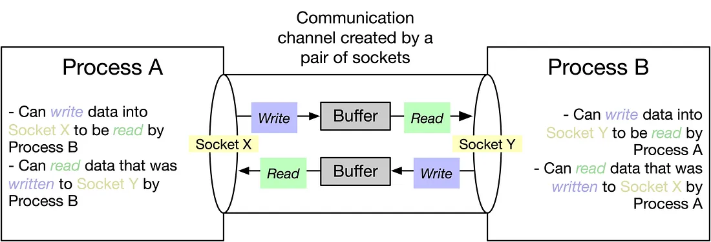
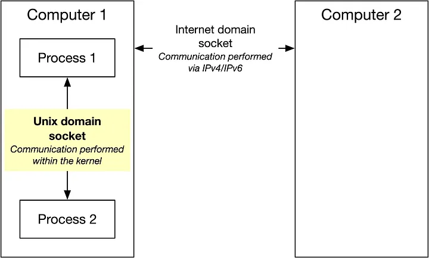
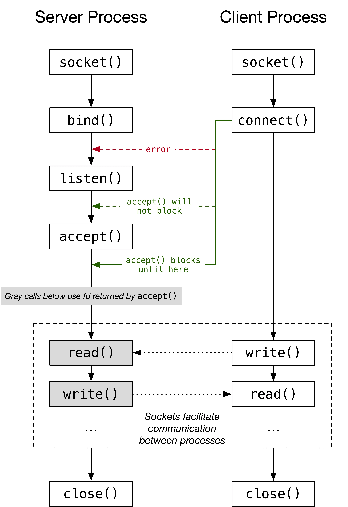

UDS示例
===========================================================

套接字IPC：

UDS(Unix-Domain-Socket)和IDS(Internet-Domain-Socket)的区别：

.. note:: 每个套接字有2个重要属性: 域（domain）、类型（type）。类型主要分2种，流（stream）和数据报（datagram）。

服务代码：

::

    #include "error_functions.h"
    #include "unix_socket.h"

    #include <errno.h>
    #include <stdio.h>
    #include <string.h>
    #include <unistd.h>

    #define BACKLOG 5

    int main(int argc, char *argv[]) {
    struct sockaddr_un addr;

    // 创建一个新的服务套接字，域:AF_UNIX, 类型:SOCK_STREAM, 协议:0
    int sfd = socket(AF_UNIX, SOCK_STREAM, 0);
    printf("服务套接字句柄 = %d\n", sfd);

    // 确保套接字句柄合法
    if (sfd == -1) {
        errExit("socket");
    }

    // 确保计划使用的地址没有太长
    if (strlen(SV_SOCK_PATH) > sizeof(addr.sun_path) - 1) {
        fatal("服务套接字地址太长: %s", SV_SOCK_PATH);
    }

    // 删除路径上已存在的任何文件，确保删除成功。
    // 如果不存在文件或文件夹，也OK。
    if (remove(SV_SOCK_PATH) == -1 && errno != ENOENT) {
        errExit("移除-%s", SV_SOCK_PATH);
    }

    // 内存地址归零并设置协议族和路径
    memset(&addr, 0, sizeof(struct sockaddr_un));
    addr.sun_family = AF_UNIX;
    strncpy(addr.sun_path, SV_SOCK_PATH, sizeof(addr.sun_path) - 1);

    // 绑到一个众所周知的地址上，以便客户端知道去哪连接
    if (bind(sfd, (struct sockaddr *) &addr, sizeof(struct sockaddr_un)) == -1) {
        errExit("bind");
    }

    // 监听调用将套接字标记为*被动*，套接字随后将用于接收*主动*套接字连接。
    // 无法在已连接的套接字上调用监听（已成功执行connect()的套接字或调用accept()返回的套接字）
    if (listen(sfd, BACKLOG) == -1) {
        errExit("listen");
    }

    ssize_t numRead;
    char buf[BUF_SIZE];
    // 阻塞处理客户端连接
    for (;;) {

        // 接收一个连接。连接返回一个新的套接字（'cfd'）
        // 正在监听的套接字（'sfd'）保持打开，并可用于接收更多的连接。
        printf("静候连接...\n");
        // 注意：阻塞直到连接到来时解除
        int cfd = accept(sfd, NULL, NULL);
        printf("接收到套接字句柄 = %d\n", cfd);

        //
        // 传输来自相连套接字的数据到标准输出中，直到出现EOF
        //

        // 从标准输入读取最多BUF_SIZE个字节到buf上
        while ((numRead = read(cfd, buf, BUF_SIZE)) > 0) {
        // 然后，将buf中的这些字节写入套接字中
        if (write(STDOUT_FILENO, buf, numRead) != numRead) {
            fatal("partial/failed write");
        }
        }

        if (numRead == -1) {
        errExit("read");
        }

        if (close(cfd) == -1) {
        errMsg("close");
        }
    }
    }

客户代码：

::

    #include "error_functions.h"
    #include "unix_socket.h"

    #include <stdio.h>
    #include <stdlib.h>
    #include <string.h>
    #include <unistd.h>

    int main(int argc, char *argv[]) {
        struct sockaddr_un addr;
        ssize_t numRead;
        char buf[BUF_SIZE];

        // 创建一个新的客户套接字，域:AF_UNIX, 类型:SOCK_STREAM, 协议:0
        int sfd = socket(AF_UNIX, SOCK_STREAM, 0);
        printf("客户套接字句柄 = %d\n", sfd);

        // 确保套接字句柄合法
        if (sfd == -1) {
        errExit("socket");
        }

        //
        // 结构化服务地址并与其连接
        //
        memset(&addr, 0, sizeof(struct sockaddr_un));
        addr.sun_family = AF_UNIX;
        strncpy(addr.sun_path, SV_SOCK_PATH, sizeof(addr.sun_path) - 1);

        // 把的活跃的sfd套接字连接到addr指定地址的监听套接字上
        if (connect(sfd, (struct sockaddr *) &addr,
                    sizeof(struct sockaddr_un)) == -1) {
        errExit("connect");
        }

        //
        // 拷贝标准输入到socket中
        //

        // 从标准输入读取最多BUF_SIZE个字节到buf上
        while ((numRead = read(STDIN_FILENO, buf, BUF_SIZE)) > 0) {
        // 然后，将buf中的这些字节写入套接字中
        if (write(sfd, buf, numRead) != numRead) {
            fatal("partial/failed write");
        }
        }

        if (numRead == -1) {
        errExit("read");
        }

        // 关闭套接字，服务端可看见EOF
        exit(EXIT_SUCCESS);
    }

交互图：

代码下载：

* :download:`error_functions.c <./res/uds/error_functions.c>`
* :download:`error_functions.h <./res/uds/error_functions.h>`
* :download:`unix_client_socket.c <./res/uds/unix_client_socket.c>`
* :download:`unix_server_socket.c <./res/uds/unix_server_socket.c>`
* :download:`unix_socket.c <./res/uds/unix_socket.h>`

编译：

::
    
    gcc unix_client_socket.c error_functions.c -o client
    gcc unix_server_socket.c error_functions.c -o server
