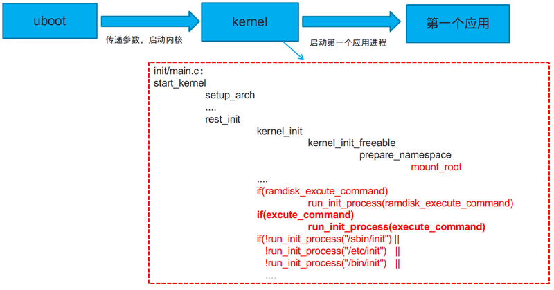

守护进程注册
===========================================================

官方文档参考：

1. `procd init scripts <https://openwrt.org/docs/guide-developer/procd-init-scripts>`_
2. `procd.sh <https://git.openwrt.org/?p=openwrt/openwrt.git;a=blob;f=package/system/procd/files/procd.sh>`_

OpenWrt的第一个进程是 procd，其作为父进程可监控子进程的状态，一旦子进程退出可在某一时刻尝试进行进程重启。

在OpenWrt中注册守护进程也就是向 /etc/init.d 添加脚本文件。

脚本文件需：

* START 参数，说明在启动时的优先级
* STOP 参数，如果在启动后需要关闭时设置，其值必须大于START
* 函数：

    * start() 执行程序
    * stop() 关闭程序

procd初始化脚本

1. 不同的Shebang Line: `#!/bin/sh /etc/rc.common`
2. 显示指定使用procd: `USE_PROCD=1`

脚本如何工作？

脚本有两项主要任务：

1. 定义服务实例的当前配置
   
   * 由 `start_service()` 承接
   * 还可指定 `reload_service()`

2. 指定何时何样重新配置服务

   * 由 `service_triggers()` 承接，使用 `procd_add_*_trigger` helper

实例：

::

    start_service() {
        procd_open_instance [instance_name]
        procd_set_param command /sbin/your_service_daemon -b -a --foo # 必须在**前台**运行的服务。 
        procd_append_param command -bar 42 # 追加命令参数

        # 
        # respawn automatically if something died, be careful if you have an alternative process supervisor
        # if process exits sooner than respawn_threshold, it is considered crashed and after 5 retries the service is stopped
        # if process finishes later than respawn_threshold, it is restarted unconditionally, regardless of error code
        # notice that this is literal respawning of the process, not in a respawn-on-failure sense
        procd_set_param respawn ${respawn_threshold:-3600} ${respawn_timeout:-5} ${respawn_retry:-5}

        procd_set_param env SOME_VARIABLE=funtimes  # 将环境变量传递给你的进程
        procd_set_param limits core="unlimited"  # 如果你需要为你的进程设置 ulimit
        procd_set_param file /var/etc/your_service.conf # 当 /etc/init.d/your_service 文件更改时将重新启动守护进程
        procd_set_param netdev dev # 同样，但当 dev 的 ifindex 更改时。 
        procd_set_param data name=value ... #  同样，但当该数据更改时。
        procd_set_param stdout 1 # 将命令的 stdout 转发到 logd 
        procd_set_param stderr 1 # 与 stderr 相同
        procd_set_param user nobody # 以无人用户身份运行服务
        procd_set_param pidfile /var/run/somefile.pid # 在实例启动时写入 pid 文件并在停止时删除它
        procd_set_param term_timeout 60 # 在发送 SIGKILL 之前等待
        procd_close_instance
    }

OpenWrt为什么使用procd-init而不是busybox-init？
-----------------------------------------------------------

业务需求驱动，适中的、符合业务规模的、好用、轻量、功能全面。

OpenWrt中procd何时运行/etc/init.d中的脚本？
-----------------------------------------------------------

启动次序应如是：

`/init - > /sbin/init -> /etc/preinit -> /sbin/procd -> /etc/rc.d/*`

能否实现 procd-init 和 busybox-init 的切换？
-----------------------------------------------------------

Tina中实现了，参考 `Tina procd-init 与 busybox-init 切换 <https://bbs.aw-ol.com/topic/1889/tina-procd-init-%E4%B8%8E-busybox-init-%E5%88%87%E6%8D%A2>`_

1. 如果ramdisk_execute_command变量指定了要运行的程序，则启动它。
    ramdisk_execute_command的取值分三种情况:
    
    1. 如果命令行参数指定了“rdinit=xxx”，则ramdisk_execute_command等于这个参数指定的程序
    2. 否则，如果/init程序存在，ramdisk_execute_command就等于“/init”。
    3. 否则，ramdisk__execute_command为空

2. 如果execute_command变量指定了要运行的程序，启动它。
    如果命令行参数指定了"init=..."，则execute_command等于这个参数指定的程序，否则为空

3. 如果ramdisk_execute_command和execute_command参数都没有指定，
   则依次执行”/sbin/init、/etc/init、/bin/init、/bin/sh“

在tina系统中，我们可以通过去修改env.cfg文件”rdinit=xxx“或”init=xxx“参数来指定启动的第一个用户进程