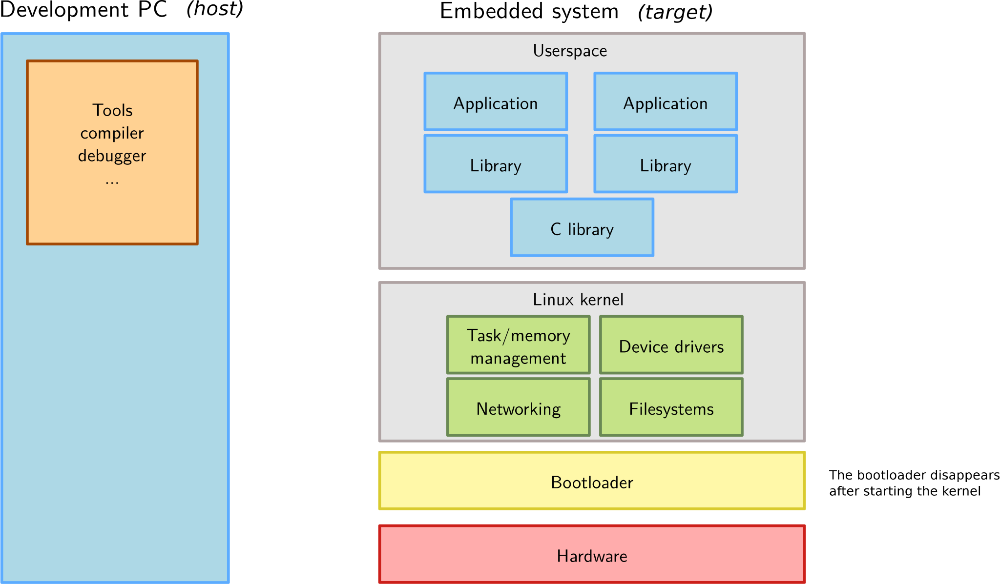
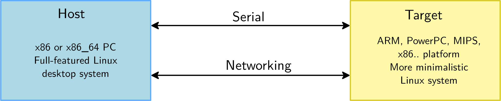
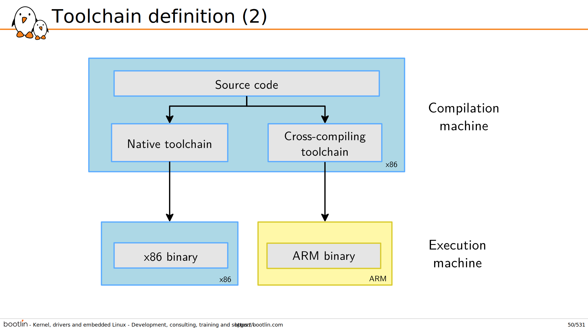

嵌入式Linux通识学习
===========================================================

学习目标
~~~~~~~~~~~~~~~~~~~~~~~~~~~~~~~~~~~~~~~~~~~~~~~~~~~~~~~~~~~

* 能够理解嵌入式Linux系统的整体架构

* 能够选择、构建、设置和使用交叉编译工具链

* 能够理解嵌入式Linux系统的引导顺序，并设置和使用U-Boot bootloader

* 能够选型Linux内核版本，并在嵌入式系统上配置、构建和安装Linux内核

* 能够从零构建Linux rootfs，包括所有它的组件：目录、应用、配置文件、库

* 能够在一个嵌入式Linux系统上选型、交叉编译和集成开源软件组件（库、应用）

* 能够理解主要的开源许可证

* 能够设置和使用嵌入式Linux构建系统，并针对一个嵌入式平台构建一个完整系统

* 能够在嵌入式Linux系统上开发和调试应用

嵌入式Linux介绍
~~~~~~~~~~~~~~~~~~~~~~~~~~~~~~~~~~~~~~~~~~~~~~~~~~~~~~~~~~~

自由软件的诞生
-----------------------------------------------------------

* 1983, Richard Stallman, GNU project and the free software concept. Beginning of the development of gcc, gdb, glibc and other important tools

* 1991, Linus Torvalds, Linux kernel project, a UNIX-like operating system kernel. Together with GNU software and many other open-source components: a completely free operating system, GNU/Linux

* 1995, Linux is more and more popular on server systems

* 2000, Linux is more and more popular on embedded systems

* 2008, Linux is more and more popular on mobile devices and phones

* 2012, Linux is available on cheap, extensible hardware: Raspberry Pi, BeagleBone Black

何为自由软件？
-----------------------------------------------------------

* 取决于其许可证是否提供以下4点关于自由的保障：

    * 软件可用于任何目的

    * 可自由学习并更改它

    * 可自由重新分发副本

    * 可自由分发修改版副本

* 可非商用也可商用

* 自由软件源码的可用性决定了它可以被修改并分发给客户，非常适合嵌入式系统

什么是嵌入式Linux？
-----------------------------------------------------------

定义
^^^^^^^^^^^^^^^^^^^^^^^^^^^^^^^^^^^^^^^^^^^^^^^^^^^^^^^^^^^

嵌入式Linux是在嵌入式系统中使用Linux内核和各种开源组件。

嵌入式系统中Linux和开源组件的优势：
^^^^^^^^^^^^^^^^^^^^^^^^^^^^^^^^^^^^^^^^^^^^^^^^^^^^^^^^^^^

* 组件复用

    * 支持大量功能、协议和硬件。只用关注你的产品的增量部分。

* 超低投入

    * 没有每个单位的版权费，开发工具同样免费。开发人员除外。

* 全权掌控

    * 自己决定合适在自己的系统中更新组建。不用绑定供应商，保障投资。

* 易于尝试新功能

    * 无需与第三方供应商合作，只需探索社区发布的新的解决方案。

* 质量

    * 你的系统构建在高质量的基础设施上（kernel、编译器、C库、基础工具...）。大量开源应用同样有好的质量。

* 安全性

    * 你可以跟踪所有系统组件的来源，并执行独立的漏洞评估。

* 社区支持

    * 如果你以建设性的态度对待它，可从社区获得大力支持。

* 参与社区工作

    * 有可能与同行合作，并获得超越公司间间隙的机会。http://localhost:37583/%E5%B5%8C%E5%85%A5%E5%BC%8F/U-Boot/index.html

一些运行Linux的嵌入式系统例子：
-----------------------------------------------------------

1. 无线路由器
2. 视频系统（Chromecast、火棒...）
3. 自行车电脑
4. 小车机器人
5. 空间站（starlink、火箭、火星探测器）

   * .. image:: res/Linux_on_Mars.png
        :width: 200px

   * .. image:: res/Linux_on_Mars_arch.png
        :width: 400px

   * .. note:: See the Linux on Mars: How the Perseverance Rover and Ingenuity Helicopter Leveraged Linux to Accomplish their Mission presentation from Tim Canham (JPL, NASA): https://youtu.be/0_GfMcBmbCg?t=111

嵌入式Linux系统的硬件
-----------------------------------------------------------

处理器及架构：
^^^^^^^^^^^^^^^^^^^^^^^^^^^^^^^^^^^^^^^^^^^^^^^^^^^^^^^^^^^

Linux内核和大多独立架构的组件都能支持广泛的32位和64位架构：

* x86和x86_64常见于PC，但嵌入式系统也有（在多媒体、工业上）

* ARM，数百种不同的片上系统（SoC：CPU+片上设备，适用于各种产品）

* RISC-V，具有自由指令集的新架构（从高端的云计算到最小化的嵌入式系统）

* PowerPC，主要用于实时工业应用

* MIPS，主要用于网络应用

* Microblaze（Xilinx）、Nios II（Altera），FPGA上用的软核

* 其他：ARC、m68k、Xtensa、SuperH...

* 支持带 MMU 或不带 MMU 的，不带 MMU 的有部分限制

* Linux 不支持小型微控制器（8位或16位）

* 除工具链、引导加载程序、内核外，所有其他组件通常与架构无关。

内存和存储：
^^^^^^^^^^^^^^^^^^^^^^^^^^^^^^^^^^^^^^^^^^^^^^^^^^^^^^^^^^^

* RAM：8MB以内可工作一个极简的Linux系统，通常更可靠的方式是使用至少32MB。取决于应用的类型和体积。

* 存储：4MB以内可工作一个极简的Linux系统，通常更多

    * 块存储：SD/MMC/eMMC、USB mass storage、SATA等

    * 也支持原始flash存储，包括NAND和NOR flash，使用特定的文件系统

* 没必要对RAM/存储容量限制太多，冗余度可提升性能、尽可能多得重用现有组件

通信总线
^^^^^^^^^^^^^^^^^^^^^^^^^^^^^^^^^^^^^^^^^^^^^^^^^^^^^^^^^^^

Linux内核支持大量通用通信总线：

* I2C
* SPI
* 1-wire
* SDIO
* PCI
* USB
* Can（汽车大量使用）

还有广泛的网络支持：

* 以太网、Wifi、蓝牙、CAN...
* IPv4、IPv6、TCP、UDP、SCTP、DCCP...
* 防火墙、高级路由、多播

硬件平台类型
^^^^^^^^^^^^^^^^^^^^^^^^^^^^^^^^^^^^^^^^^^^^^^^^^^^^^^^^^^^

* SoC开发板（Evaluation platforms），SoC厂商提供，昂贵、有大量内置外设，用于产品开发。

* 模组（System on Module，SoM），一块只有CPU/RAM/flash和少量核心组件、连接到其他外设的小板。用于构建中小型设备的最终产品。

* 社区开发板，可用、价格实惠、有少量外设（相比SoC开发版），也可用于产品开发。

* 自定义板子，开发自定义平台。

硬件选型标准
^^^^^^^^^^^^^^^^^^^^^^^^^^^^^^^^^^^^^^^^^^^^^^^^^^^^^^^^^^^

* 大多数SoC都支持Linux内核和开源引导加载程序

* 在项目的官方版本中支持您的SoC（内核、bootloader）要更好，质量更好、有新版本可用，有长期支持版本（LTS）支持。

* 一些SoC供应商或主板供应商没有将其更改反馈到Linux内核主线。请他们这么做，或者如果可以的话使用其他产品。一个好的衡量标准是看它们的内核和官方内核之间的差异。

* 在官方Linux内核中得到适当支持的硬件和不太受支持的硬件之间，开发时间和成本存在巨大差异。

嵌入式Linux系统架构
-----------------------------------------------------------

host（主机）和target（目标机）

软件组件
^^^^^^^^^^^^^^^^^^^^^^^^^^^^^^^^^^^^^^^^^^^^^^^^^^^^^^^^^^^

* 交叉编译工具链（Cross-compilation toolchain）

    * 在开发机上运行编译器，仅生成目标平台代码

* 引导加载程序（Bootloader）

    * 从硬件开始，用于基本硬件的初始化、加载和运行内核

* Linux内核

    * 包含进程、内存管理，网络栈，设备驱动，提供用户空间应用服务

* C库

    * C函数的库
    * 内核和用户空间应用之间的接口

* 库和应用

    * 第三方或内部

嵌入式Linux工作
^^^^^^^^^^^^^^^^^^^^^^^^^^^^^^^^^^^^^^^^^^^^^^^^^^^^^^^^^^^

在产品中部署嵌入式Linux通常有以下三个类型的明确任务：

* 板级包开发

    * BSP中包含了适用于目标硬件的带有合适的设备驱动的bootloader和kernel
    * 这是内核开发的目标

* 系统集成

    * 集成所有的组件、bootloader、kernel、三方库及应用、内部应用到一个工作系统中
    * 这是嵌入式Linux开发的目标

* 应用开发

    * 普通Linux应用，但使用特别选择的库。

嵌入式Linux开发环境
~~~~~~~~~~~~~~~~~~~~~~~~~~~~~~~~~~~~~~~~~~~~~~~~~~~~~~~~~~~

Linux开发用OS
-----------------------------------------------------------

强烈推荐嵌入式Linux开发者使用 GNU/Linux 作为桌面OS，原因如下：

* 所有社区工具都是为在Linux上运行而开发和设计的，在windows、macos上使用会带来麻烦。

* 一以贯之的Linux使用方式。

* WSL2用于实际开发时，有诸多弊病且无法解决，比如docker的问题。

主机和目标机的通讯
-----------------------------------------------------------

嵌入式开发的明确分割线：

* 主机（hist），开发机，高性能PC

* 目标机（target），正在开发的嵌入式系统

* 之间通过各种方式相连：

    * 串行线连接：几乎总是，调试用
    * 网络连接：经常
    * JTAG接口连接：用于low-level调试

串行通信程序
-----------------------------------------------------------

.. _tio: https://github.com/tio/tio

* 嵌入式开发的基础工具就是串行通信程序，好比Windows中的HyperTerminal

* Linux中有大量可选项：Minicom, Picocom, Gtkterm, Putty, screen, tmux, `tio`_(比较新)

* 推荐使用 Picocom
    
    * 语法： picocom -b BAUD_RATE /dev/SERIAL_DEVICE
    * 示例： picocom -b 115200 /dev/ttyUSB0
    * 退出： CTRL-A + CTRL-X

* 典型串口设备：

    * ttyUSBx 用于USB转串口

    * ttySx 用于真实串口端口

交叉编译工具链
~~~~~~~~~~~~~~~~~~~~~~~~~~~~~~~~~~~~~~~~~~~~~~~~~~~~~~~~~~~

定义及组件
-----------------------------------------------------------

通常GNU/Linux工作环境下的可用开发工具属于原生工具链，生成工作环境下的代码，如x86架构的。

嵌入式系统开发，通常不可能或不会使用原生工具链：

    * 目标机资源受限（存储、内存）
    * 目标机速度慢（相比桌面PC）
    * 不会在目标机上安装所有的开发工具

因此通常在桌面工作环境下使用交叉编译工具链，用于生成目标机的代码。

架构元组构成及工具链前缀
-----------------------------------------------------------

大部分UNIX/Linux构建工具都依赖“架构元组”来识别机器。

示例：arm-linux-gnueabihf, mips64el-linux-gnu, arm-vendor-none-eabihf

架构元组由3或4部分组成：

1. CPU架构名：arm、risc-V、mips64el...

2. （可选）厂商名

3. 系统名，当不以操作系统为目标时为none

4. ABI/C库名

架构元组可用于：

* 配置/构建给定平台的软件
* 作为交叉编译工具的前缀，来同原生工具区分开：
    * gcc --- 原生编译器
    * arm-linux-gneeabihf-gcc --- 交叉编译器

gcc工具链的组件图
-----------------------------------------------------------

.. image::
    res/gcc_toolchains_components.svg

Binutils
^^^^^^^^^^^^^^^^^^^^^^^^^^^^^^^^^^^^^^^^^^^^^^^^^^^^^^^^^^^

.. _GNU Binutils: https://www.gnu.org/software/binutils/

Binutils是一组工具集，包含生成和操作指定CPU架构的二进制文件，通常使用ELF格式。

如：

* as，汇编器（assembler），从汇编源码生成二进制代码
* ld，链接器
* ar，ranlib，生成.a归档（静态库）
* objdump，readelf，size，nm，strings，用于检查二进制，非常有用的分析工具
* objcopy，修改二进制
* strip，剥离调试所需的部分二进制文件（缩减体积）

详见 `GNU Binutils`_

C/C++编译器
^^^^^^^^^^^^^^^^^^^^^^^^^^^^^^^^^^^^^^^^^^^^^^^^^^^^^^^^^^^

.. _GCC: https://gcc.gnu.org/

* `GCC`，GNU编译器的集合
* 支持编译C、C++、Ada、Fortan、Java、Objective-C、Objective-C++、Go...
* 可针对海量CPU架构生成代码
* GPL许可证

内核头文件
^^^^^^^^^^^^^^^^^^^^^^^^^^^^^^^^^^^^^^^^^^^^^^^^^^^^^^^^^^^

.. _include/uapi: https://elixir.bootlin.com/linux/latest/source/include/uapi/

* C标准库和编译后的程序需要与内核交互

    * 可用的系统调用，及对应编号
    * 常量定义
    * 数据结构...

* 所以，编译C标准库需要内核头文件，大量的应用也同样需要它们。

* 适用于 `<linux/...>` 和 `<asm/...>` 和其他几个目录，这些目录在 `include/uapi`_ 和 `arch/<arch>/include/uapi` 中可见

* 使用 headers_install 内核 Makefile 目标从内核源码中提取内核头文件

* 系统调用编号，在 `<asm/unistd.h>` 中

::

    #define __NR_exit       1
    #define __NR_fork       2
    #define __NR_read       3
    
* 常量定义在 `<asm-generic/fcntl.h>`，包含在 `<asm/fcntl.h>` 和 `<linux/fcntl.h>` 中

::

    #define O_RDWR 00000002

* 数据结构在 `<asm/stat.h>` 中，被 stat命令使用

::

    struct stat {
        unsigned long st_dev;
        unsigned long st_ino;
        [...]
    };

内核到用户空间的接口是向后兼容的：

* 内核开发者尽最大努力在内核升级从不破坏现有程序。否则，用户会坚持使用旧内核，这对每个人都不利。

* 因此，使用比当前运行内核要老的内核头文件的工具链生成的二进制文件可以正常工作，但不能使用新的系统调用、数据结构等。

* 使用比当前运行内核要新的内核头文件的工具链生成的二进制文件，只有在不使用最新功能的情况下才能运行，否则将崩溃。

.. note:: 更新内核不应该破坏你的程序，只要老工具链对项目有效，保留使用通常没有问题。

CPIO卷和TAR卷的区别？
^^^^^^^^^^^^^^^^^^^^^^^^^^^^^^^^^^^^^^^^^^^^^^^^^^^^^^^^^^^

tar适合打包文件和目录，提供可选的压缩，常用于备份和传输文件。
cpio适合创建和解压缩initramfs、initrd等文件系统映像。

C标准库
^^^^^^^^^^^^^^^^^^^^^^^^^^^^^^^^^^^^^^^^^^^^^^^^^^^^^^^^^^^

glibc
"""""""""""""""""""""""""""""""""""""""""""""""""""""""""""
