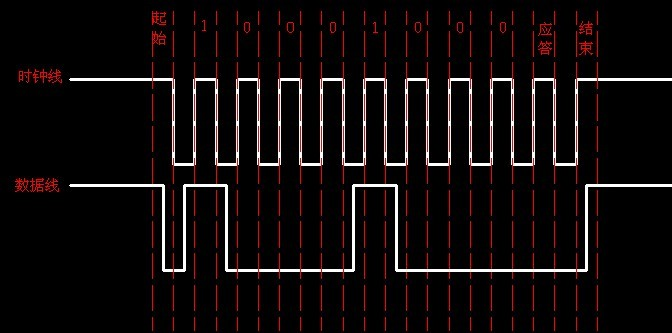

I2C总线
==========

I2C（读作：I方C）总线示意图：

.. image::
    res/I2C_controller-target.svg

其物理连接十分简单，仅由`SDA(串行数据线)`和`SCL(串行时钟线)`及上拉电阻组成。

通信原理：通过对SCL和SDA线高低电平时序的控制，来产生I2C总线协议所需要的信号，进行数据的传递。

在总线空闲的状态下，这两根线一般被上面所接的上拉电阻拉高，保持高电平。

作用：I2C总线通过挂载的器件的地址来区分并访问不同的设备器件，因此可被多个设备共享，只要地址不发生冲突。大多数传感器都支持I2C接口。

.. tip:: I2C总线通信为半双工，只有1根SDA，同一时刻只能单向通信，主从间以字节（8位）为单位进行双向数据传输。

I2C总线协议
=============

在I2C总线上，协议规定的数据传输起止信号为：

* 开始条件：一个起始信号（主机输出），总线空闲时SCL和SDA保持高电平，当SCL为高而SDA由高转低跳变
* 停止条件：一个结束信号（主机输出），当SCL为高而SDA由低转高跳变

I2C电平变化示意图：

I2C通信示意图：

上图中的过程：当一个字节按数据位高位先行的顺序传输完后，从机拉低SDA线，回传主设备一个应答位，此时才认为一个字节真正被传输完成。

.. tip:: UART是低位先行

I2C写寄存器的示例：

.. image::
    res/i2c_w.webp

树莓派使用I2C接口
~~~~~~~~~~~~~~~~~~~~~

raspi-config 或在 GUI 中打开 I2C 开关（背后对应动态加载I2C内核驱动），前后可通过lsmod检查。

树莓派的40针引脚图：

.. image::
    ../res/GPIO-Pinout-Diagram-2.png

I2C接线需要使用3号（SDA）和5号引脚（SCL）

ModelB