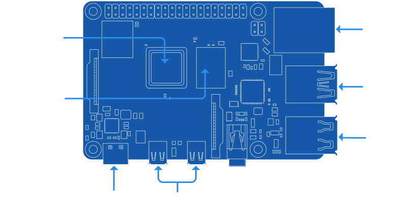

技术规格
===========================================================

https://www.raspberrypi.com/products/raspberry-pi-4-model-b/specifications/

规格
-----------------------------------------------------------

Broadcom BCM2711，四核 Cortex-A72 (ARM v8) 64 位 SoC @ 1.8GHz
1GB、2GB、4GB 或 8GB LPDDR4-3200 SDRAM（取决于型号）
2.4 GHz 和 5.0 GHz IEEE 802.11ac 无线、蓝牙 5.0、BLE
千兆位以太网
2 个 USB 3.0 端口； 2 个 USB 2.0 端口。
Raspberry Pi 标准 40 针 GPIO 接头（完全向后兼容以前的板）
2 个 micro-HDMI® 端口（最高支持 4kp60）
2 通道 MIPI DSI 显示端口
2 通道 MIPI CSI 摄像头端口
4 极立体声音频和复合视频端口
H.265（4kp60 解码）、H264（1080p60 解码、1080p30 编码）
OpenGL ES 3.1、Vulkan 1.0
Micro-SD卡插槽用于加载操作系统和数据存储
通过 USB-C 连接器提供 5V DC（最小 3A*）
通过 GPIO 接头提供 5V DC（最小 3A*）
启用以太网供电 (PoE)（需要单独的 PoE HAT）
工作温度：0 – 50 摄氏度环境温度
* 如果下游 USB 外设总消耗电流小于 500mA，则可以使用优质 2.5A 电源。