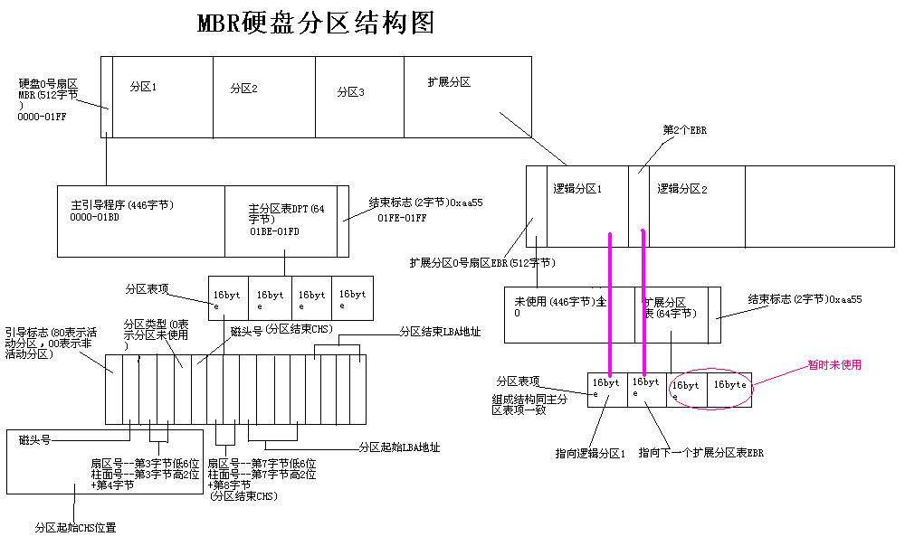

MBR分区表
===========

硬盘结构及参数
-----------------

- H - Head：磁头，磁头数表示硬盘有多少个磁头，也就是有多少个盘面，最大为256。
- C - Cylinder：柱面，柱面数表示硬盘的每个盘面上有多少条磁道，最大为1024。
- S - Sector：扇区，扇区数表示每条磁道有多少个扇区，最大为63.

.. note:: 当磁盘旋转时，磁头若保持在一个位置上，则每个磁头都会在磁盘表面上画出一个圆形轨迹，这些圆形轨迹就叫磁道。

MBR分区
-----------

MBR磁盘分区，也成为DOS分区结构，MBR分区由以下四部分组成：

1. 引导代码：占据前400个字节，负责整个系统的启动，如果引导代码被破坏，将导致系统无法启动。
2. 磁盘签名：占据之后的4个字节，如果此标签被破坏后则会提示初始化磁盘。
3. MBR分区表：占据之后的64个字节，是整个硬盘的分区表。
4. MBR结束标志：占据MBR扇区的最后两个字节，一直为“55 AA”

其中，MBR分区表占据的64个字节，当中每16个字节为一个“分区表项”，每个分区表项对应的字节解释如下：

========  ========  ===========  =========================================================
字段偏移  字段长度    值           字段名和定义
========  ========  ===========  =========================================================
0x01BE    1字节      0x80        引导标志（Boot Indicator）：指明该分区是否是活动分区
0x01BE    1字节      0x80        引导标志（Boot Indicator）：指明该分区是否是活动分区
0x01BF    1字节      0x01        开始磁头（Start Head）
0x01C0    6位        0x01        起始扇区（Start Sector）：只用了0～5位，后面的两位（第6位和第7位）被开始柱面字段所使用                      
0x01C1    10位       0x00        起始柱面（Start Cylinder）：共占用10位，最大值为1023                                                  
0x01C2    1字节      0x07        分区的类型描述（Partition type indicator）：定义了分区的类型，详细定义                                  
0x01C3    1字节      0xFE        结束磁头（End Head）                                                                              
0x01C4    6位        0xFF        结束扇区（End Sector）：只使用了0～5位，最后两位（第6、7位）被结束柱面字段所使用                           
0x01C5    10位       0xFF        结束柱面（End Cylinder）：结束柱面是一个10位的数，最大的值为1023                                       
0x01C6    4字节      0x0000003F  本分区之前使用的扇区数（Sectors preceding partition）：指从该磁盘开始到该分区开始之前的偏移量，以扇区数来表示 
0x01CA    4字节      0x01388AFC  分区的总扇区数（Sectors in partition）：指该分区所包含的扇区总数  
========  ========  ===========  =========================================================

扩展分区的结构分析由于MBR仅仅为分区表保留了64字节的存储空间，而每个分区则占用16字节的空间，也就是只能分4个分区，而4个分区在实际情况下往往是不够用的。
因此就有了扩展分区，扩展分区中的每个逻辑分区的分区信息都存在一个类似MBR的扩展引导记录(简称EBR)中，扩展引导记录包括分区表和结束标志“55 AA”，没有引导代码部分。

- 扩展分区

所谓扩展分区，严格讲它不是一个实际意义的分区，它仅仅是一个指向下一个分区的指针，这种指针结构将形成一个单向链表。这样在主引导扇区中除了主分区外，仅需要存储一个被称为扩展分区的分区数据，
通过这个扩展分区的数据可以找到下一个分区(实际上也就是下一个逻辑磁盘)的起始位置，以此位置类推可以找到所有的分区

- 扩展分区结构

扩展分区结构: 扩展引导记录(EBR) + 逻辑分区

扩展引导记录: 类似于MBR的扩展引导记录，扩展引导记录包括一个扩展分区表和该扇区的标签

- 扩展分区表

用于记录分区状态，每16bytes为一项，共四项

1) 指向它自身的引导扇区
2) 指向下一个逻辑驱动器的EBR
3) 未使用
4) 未使用

- MBR分区说明

- 常见分区方式

.. code-block:: console

   (.venv) $ pip install lumache

分区表和文件系统的关系
------------------------

分区表一般由磁盘分区工具（MBR-fdisk, GPT-gdisk, parted...）创建，它将物理磁盘划分为多个逻辑部分。

文件系统是在每个分区上创建的逻辑结构，用于组织和管理文件和目录。

分区表提供了逻辑隔离、独立管理的功能。

文件系统负责管理文件的存储和访问。
