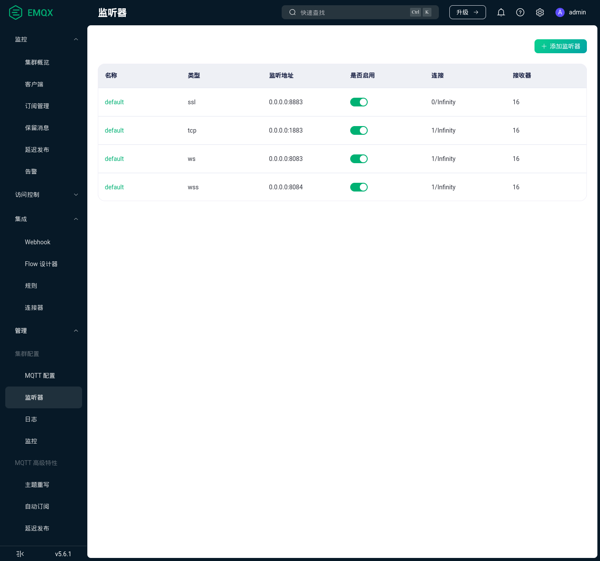

EMQX的JavaScript使用指南
======================================

MQTT（Message Queueing Telemetry Transport）是轻量级、使用发布-订阅机制的消息传输协议。

同时已基于EMQX商业软件的免费版搭建好MQTT后台服务，现在有1个需求如下：

前台Web控制面板也需要接入MQTT，并订阅某一类告警消息，当后台端或设备端发布此类告警消息时，前台
Web控制面板可弹出告警消息以提示管理者。

对于此需求，EMQX商业软件足够成熟，已提供了JavaScript SDK用以实现此类需求，使得实现足以简单。

参考 `EMQX文档使用 JavaScript SDK 连接 <https://docs.emqx.com/zh/emqx/v5.6/connect-emqx/javascript.html>`_ 
及实际测试，大致步骤如下。

在 `EMQX后台监听器页面中可见 <http://mqtt.starkylin.xyz:18083/#/listener>`_，已添加ssl、tcp、ws、wss等协议监听器。

对于前台Web控制面板来说，只需关注ws和wss监听器，端口分别为8083和8084。

我们按照先测试nodejs后测试browser，先测试连接通路后测试订阅-发布的顺序来验证需求实现的基本要求。

借助nodejs使用，为方便使用，可全局安装mqtt模块，npm i mqtt -g。

第1步，借助nodejs测试本地ws连接通路
-----------------------------------------

在 test_ws.js 中，编写以下：

::

    const mqtt = require('mqtt')

    const options = {
        clientId: 'emqx_test_ws_nodejs',
        username: 'eb2603bb540f27b2',
        password: 'aTXhZZdJySgP1aZ1VQPuJoRfvkYiSkgC8M9CYYu2WoKF',
    }

    const connectUrl = 'ws://mqtt.starkylin.xyz:8083/mqtt'
    const client = mqtt.connect(connectUrl, options)

    client.on('reconnect', (error) => {
        console.log('正在重连:', error)
    })

    client.on('error', (error) => {
        console.log('连接失败:', error)
    })

    client.on('connect', () => {
        console.log('连接成功')
    })

.. note:: 注意，使用给定的用户名、密码，使用ws协议， 使用相匹配的8083端口，使用/mqtt地址。

效果验证：

1. 运行：node test_ws.js
2. 打印：连接成功

    .. image:: ./res/WS连接成功.png

3. 在 `EMQX后台客户端面板 <http://mqtt.starkylin.xyz:18083/#/clients>`_ 刷新后可见已添加监听的客户端 emqx_test_ws_nodejs。

    .. image:: ./res/EMQX后台客户端面板见ws测试连接.png

第2步，借助nodejs测试本地wss连接通路
-----------------------------------------

在 test_wss.js 中，编写以下：

::

    const mqtt = require('mqtt')

    const options = {
        clientId: 'emqx_test_wss_nodejs',
        username: 'eb2603bb540f27b2',
        password: 'aTXhZZdJySgP1aZ1VQPuJoRfvkYiSkgC8M9CYYu2WoKF',
    }

    const connectUrl = 'wss://mqtt.starkylin.xyz:8084/mqtt'
    const client = mqtt.connect(connectUrl, options)

    client.on('reconnect', (error) => {
        console.log('正在重连:', error)
    })

    client.on('error', (error) => {
        console.log('连接失败:', error)
    })

    client.on('connect', () => {
        console.log('连接成功')
    })

.. note:: 注意，使用给定的用户名、密码，使用wss协议， 使用相匹配的8084端口，使用/mqtt地址。

效果验证：

1. 运行：node test_wss.js
2. 报出错误码 UNABLE_TO_VERIFY_LEAF_SIGNATURE，猜测是和SSL证书相关的问题
   
   .. image:: ./res/WSS连接报错UNABLE_TO_VERIFY_LEAF_SIGNATURE.png

3. `查询问题 <https://stackoverflow.com/questions/45088006/nodejs-error-self-signed-certificate-in-certificate-chain>`_ 后，
   可通过添加 export NODE_TLS_REJECT_UNAUTHORIZED='0' 暂时绕过严格的TLS验证，作为测试时的不安全手段继续验证
4. 打印：连接成功
   
   .. image:: ./res/WSS连接成功.png

5. 在 `EMQX后台客户端面板 <http://mqtt.starkylin.xyz:18083/#/clients>`_ 刷新后可见已添加监听的客户端 emqx_test_wss_nodejs 。

    .. image:: ./res/EMQX后台客户端面板见wss测试连接.png
    
第3步，借助nodejs验证订阅-发布机制
-----------------------------------------

在 test_wss_subscribe.js 中，编写以下：

::

    const mqtt = require('mqtt')

    const options = {
        clientId: 'emqx_test_wss_subscribe_nodejs',
        username: 'eb2603bb540f27b2',
        password: 'aTXhZZdJySgP1aZ1VQPuJoRfvkYiSkgC8M9CYYu2WoKF',
    }

    const connectUrl = 'wss://mqtt.starkylin.xyz:8084/mqtt'
    const client = mqtt.connect(connectUrl, options)

    client.on('reconnect', (error) => {
        console.log('正在重连:', error)
    })

    client.on('error', (error) => {
        console.log('连接失败:', error)
    })

    client.on('connect', () => {
        console.log('连接成功')
    })

    client.on('message', (topic, message) => {
        console.log('收到消息：', topic, message.toString())
    })

    client.publish('test_wss_msg', 'hello,world!')

在 test_wss_publish.js 中，编写以下：

::

    const mqtt = require('mqtt')

    const options = {
        clientId: 'emqx_test_wss_publish_nodejs',
        username: 'eb2603bb540f27b2',
        password: 'aTXhZZdJySgP1aZ1VQPuJoRfvkYiSkgC8M9CYYu2WoKF',
    }

    const connectUrl = 'wss://mqtt.starkylin.xyz:8084/mqtt'
    const client = mqtt.connect(connectUrl, options)

    client.on('reconnect', (error) => {
        console.log('正在重连:', error)
    })

    client.on('error', (error) => {
        console.log('连接失败:', error)
    })

    client.on('connect', () => {
        console.log('连接成功')
    })

    client.on('message', (topic, message) => {
        console.log('收到消息：', topic, message.toString())
    })

    client.publish('test_wss_msg', 'hello,world!')

效果验证：

1. 运行：node test_wss_subscribe.js
2. 同时运行：node test_wss_publish.js
3. 打印：连接成功、收到的hello,world!消息
   
   .. image:: ./res/WSS发布和订阅消息.png

.. note:: 也可借助 
    `EMQX后台WebSocket 客户端面板 <http://mqtt.starkylin.xyz:18083/#/websocket>`_ 辅助调试。
    同时可在 `EMQX后台主题监控面板 <http://mqtt.starkylin.xyz:18083/#/topic-metrics>`_ 中监控主题的流量。

第4步，借助browser验证订阅借助nodejs验证发布
---------------------------------------------

nodejs的test_wss_publish.js不变。

在browser的index.html，编写以下：

::

    <!DOCTYPE html>
    <html lang="en">
    <head>
        <meta charset="UTF-8">
        <meta name="viewport" content="width=device-width, initial-scale=1.0">
        <title>Document</title>
    </head>
    <body>
        
        
    </body>
    </html>

效果验证：

1. 运行：google-chrome index.html
2. 同时运行：node test_wss_publish.js
3. 浏览器打印：连接成功、收到的hello,world!消息
   
   .. image:: ./res/Brower订阅Nodejs发布.png

接下来，可以在Web前台集成使用了。
