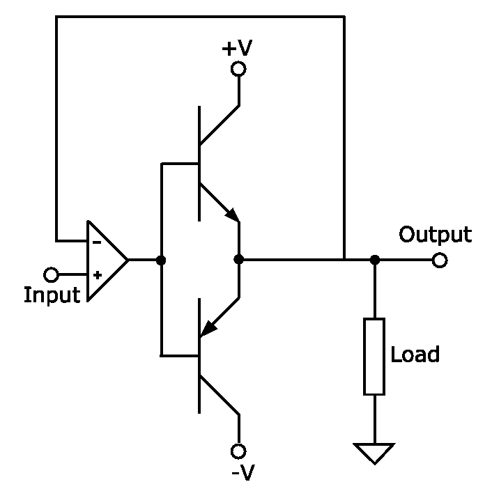

推挽输出
=============

推挽输出（Push-pull output），是一种 使用一对、选择性地、从相连负载灌电流或拉电流 的器件 的电路。

常使用一对参数相同的 功率三极管 或 场效应管（MOSFET），以推挽方式存在于电路中。电路工作时，
    两只对称的开关管每次只有一个导通，因此导通损耗小、效率高。输出既可以向负载灌电流，
    也可以从负载抽电流（拉电流）。

推挽输出既能提高电路负载能力，又能提高开关速度。

一种用 NPN或PNP三极管类的B类推挽输出：

