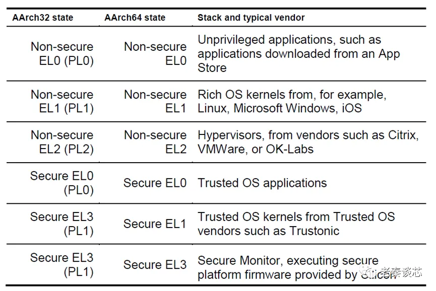

老秦谈芯-虚拟化
==========================

* ARM系列 -- 虚拟化（一） https://mp.weixin.qq.com/s/uJM8fs-FiGyGBxHLxUKruQ
* ARM系列 -- 虚拟化（二） https://mp.weixin.qq.com/s/5bcXGwd_76yuxPLRP9gLzQ
* ARM系列 -- 虚拟化（三） https://mp.weixin.qq.com/s/JPj9tiGWmExSmgYCCxDg-Q
* ARM系列 -- 虚拟化（四） https://mp.weixin.qq.com/s/Eac9RWXhDluwSuSyXvgCwg
* ARM系列 -- 虚拟化（五） https://mp.weixin.qq.com/s/2una2vrBkMNicvpQAJJgtg

虚拟化技术能带来的好处有以下几点：

* 隔离：即允许在相互不信任的计算环境之间共享物理系统。例如，两个竞争对手可以在一个数据中心共享同一台物理机器，而不能够访问彼此的数据。

* 高可用性：虚拟化技术允许在物理机器之间无缝且透明地迁移工作负载，通常用于将工作负载从可能需要维护和更换的故障硬件平台迁移出去。

* 工作负载平衡：尽可能多地使用每个硬件平台，这可以通过虚拟机的迁移来实现，或者通过在物理机上共同托管适当的工作负载来实现。

* 沙箱：虚拟机可用于为可能干扰其运行的机器其他部分的应用程序提供沙箱。在虚拟机中运行这些应用程序可以防止应用程序的错误或恶意部分干扰物理计算机上的其他应用程序或数据。

如何把虚拟机和真实的物理设备隔绝呢，或者说如何实现虚拟化。
在hardware之上加一层hypervisor。
对于hypervisor，百度百科是这样定义的，“一种运行在基础物理服务器和操作系统之间的中间软件层，可允许多个操作系统和应用共享硬件。也可叫做VMM（ Virtual Machine Monitor ），即虚拟机监视器。
Hypervisor是一种在虚拟环境中的“元”操作系统。
他们可以访问服务器上包括磁盘和内存在内的所有物理设备。
Hypervisor不但协调着这些硬件资源的访问，也同时在各个虚拟机之间施加防护。
当服务器启动并执行Hypervisor时，它会加载所有虚拟机客户端的操作系统同时会分配给每一台虚拟机适量的内存，CPU，网络和磁盘”。

有了hypervisor，我们再来看一下系统如何构成。先以汽车芯片为例，如下图。Hypervisor负责协调，控制所有的硬件资源。在hypervisor之上，把汽车行驶和安全相关的部分隔离成一部分，运行封闭操作系统（Closed OS）；把与娱乐等相关的部分隔离成另一部分，运行开放操作系统（Open OS）。相对应的应用程序（APP）运行在各自操作系统之上。这样就可以起到一个很好的隔离作用，用户自己安装的APP不会影响到汽车行驶安全。

再来看一个服务器的例子，如下图。一台服务器可能拥有很多的处理器，硬盘等。通过hypervisor，可以分配给不同的虚拟机以不同的硬件资源。比如对于VM1，可能要运行一些安全等级高的任务，这时就可以把Hardware0的资源只分配给VM1，其它的虚拟机不能访问。对于Hardware1，同时分配给VM0，VM1，VM2等多个虚拟机，充分利用其资源。

Hypervisor分为两大类:

1. Standalone hypervisor(type 1型)

    .. image:: res/Type_1_hypervisor_standalone.png

2. Hosted hypervisor(type 2型)

    .. image:: res/Type_2_hypervisor_hosted.png

两者的区别是，type 1的hypervisor是直接运行在硬件之上的，而type 2的hypervisor是运行在Host OS之中的。Type 1相当于一个轻量级的操作系统，直接跑在宿主机的硬件上；而Type 2相当于一个应用软件，运行在宿主机的操作系统之中。两者相同的是，客户操作系统（Guest OS）都是运行在hypervisor之上的。Type 1的hypervisor通常在性能上比Type 2表现的更好，更为安全。Type 2相较于type 1还有一个缺点就是延迟太高，这是因为hypervisor与硬件之间的交流还需要穿过操作系统这一层。Hosted hypervisor最多的应用场景是作为client hypervisor运行在终端用户的电脑上，而这种场景下一般是不需要关心延迟问题的。大多数企业一般选择Type 1类型的hypervisor用于数据中心的计算需求。

在ARM平台上，type 1 hypervisor比较典型的代表是Xen。

* Xen是由剑桥大学计算机实验室开发的一个开源项目。是一个直接运行在计算机硬件之上的用以替代操作系统的软件层，它能够在计算机硬件上并发的运行多个Guest OS。Xen支持x86、x86-64、Power PC和ARM多种处理器。2014年03月11日，Xen发布4.4版本，更好地支持ARM架构。Xen是半虚拟化（Para-Virtualization）技术的典型代表。半虚拟化技术，主要解决的就是如何捕获非特权指令的敏感指令。x86体系是导致半虚拟化技术产生的重要原因，因为x86体系结构中，部分敏感指令不是特权指令，这些指令不能自动产生异常，因此想要系统正常运行就必须要捕获这些指令。于是Xen采用修改Guest OS内核的方法对这些有缺陷的指令进行替换。根据直觉，既然有半虚拟化，就一定有全虚拟化，对不对？没错，你很机智，确实有“完全虚拟化”，又称“硬件虚拟化（Hardware Virtual Machine）”。简单说，两者的区别就是在半虚拟化中，Guest OS知道自己运行在Hypervisor上而不是硬件上，同时也可以识别出其他运行在相同环境中的客户虚拟机。在全虚拟化中，Guest OS任务自己运行在硬件上，无法感知其他Guest OS。

在ARM平台上，type 2 hypervisor比较典型的代表是KVM。

* KVM（Kernel-basedVirtual Machine）是一个基于Linux环境的开源虚拟化解决方案，最早由以色列Qumranet公司开发，并于2007年2月被集成到Linux 2.6.20内核中，成为内核的一部分。与VMware ESX/ESXi、微软Hyper-V和Xen等虚拟化产品不同，KVM的思想是在Linux内核的基础上添加虚拟机管理模块，重用Linux内核中已经完善的进程调度、内存管理、IO管理等代码，使之成为一个可以支持运行虚拟机的Hypervisor。

为了配合虚拟化，ARM定义了4个异常等级(Exception Level, 简称EL)，分别是EL0~3，权限级别越高。

概念:

* 执行状态(execution state)
* 安全状态(security state)

